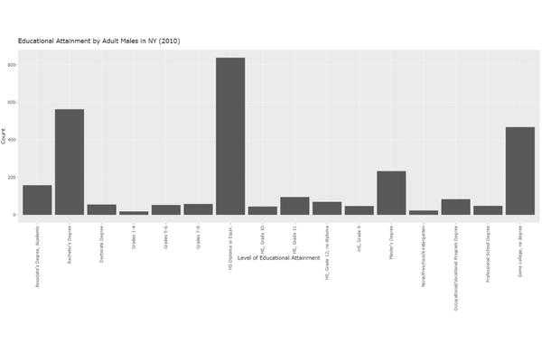
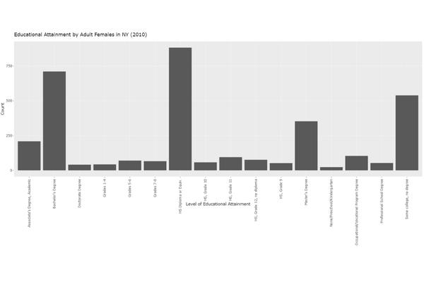
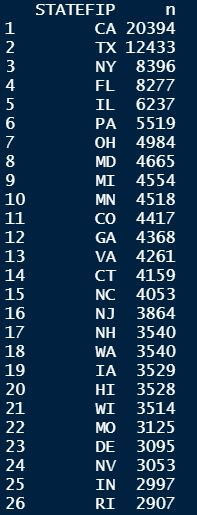
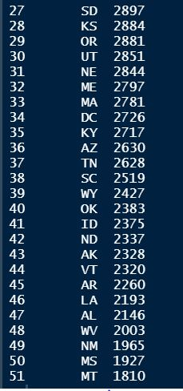
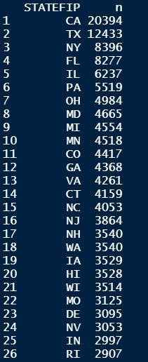
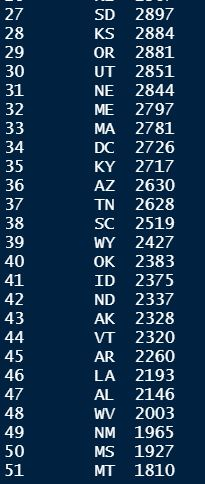
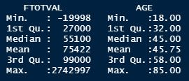

# Introduction

## Motivation

The US Census Bureau defines educational attainment as the highest level of education that an individual completes. Studying educational attainment is important because the level of education a person attains is oftentimes directly linked to the professional, personal, financial, and social opportunities available to a person. For example, a person with a lower level of educational attainment may not have access to job opportunities that require a high level of education. Or in contrast, a person with a high level of education may have access to opportunities and resources resulting from a higher social or financial status.

The level of educational attainment a person achieves could be impacted by differences in various demographic factors such as race, gender, and level of income. These demographic factors may have a say in how an individual’s personal expectations, limitations to access, and accessibility to informational resources informs their decision to pursue greater educational opportunities, such as a postsecondary education. The main goal of this research is to determine to what degree, if at all, these demographic factors (race, income, sex) play a role in determining an individual’s level of educational attainment.

There is evidence in how income, and more specifically socioeconomic status, can impact one’s education. For example, children from families with a low socioeconomic status “are less likely to have experiences that encourage the development of fundamental skills of reading acquisition” and “to have access to informational resources about college”. [@apa] Not only are access to education and development of certain skills impacted by socioeconomic status, but so is academic achievement; low-income children “enter high school with average literacy skills five years behind those of high-income students”, have a lower success rate in the fields of “science, technology, engineering, and mathematics” than those not from underrepresented groups, and have a higher likelihood of dropping out of high school (11.6%) compared to their high-income counterparts (2.8%). [@apa]

Additionally, research has shown that differences in educational attainment by gender have varied greatly over the last century, initially the trends appeared to be favorable to men but by 1982, women started to lead in rates of enrollment and graduation from high school and college. These gendered differences in educational attainment have various causes including gender expectations towards receiving a higher education, accessibility to education, opportunities available post-graduation, and personal aspirations in completing some form of postsecondary education. The gender disparities in educational attainment also intermingle with racial disparities as there are different historical trends between each racial/ethnic group and the dispersion of educational attainment also plays out differently for each group.

Race also has played a role in determining the level of education a person would complete for the better half of the last century. This is as a result of the type of opportunities to access education and ease of accessing this and other related resources available to these groups. Historical events and trends have also exacerbated the racial disparities in educational attainment such as the lingering effects of slavery and segregation.

## Current State of the Art

There has been a good amount of research done on the topic of educational attainment that has been able to capture differences in gender, race, and income, and their implications. The main focus in a lot of literature is on gendered differences in educational attainment, which seems to be a well-documented issue overall. These gendered differences seem to show that while there was at some point in time (in the past) a male-leaning dominance in levels of educational attainment, women seem to now hold the advantage in educational attainment. However, this gender gap reversal in educational attainment does not seem to reflect a reversal in the gender gap as it relates to occupations or wages.

When racial differences in educational attainment are studied, many authors tend to focus on the differences exclusively between white and black people. This neglects the disparities and differences in educational attainment that could be potentiall observed in other racial or ethnic groups. One of the goals of this study and subsequent tool is to analyze differences across different racial and ethnic groups, with special interest in observing differences in racial groups that literature has failed to cover.

In contrast, there seems to be a good breadth of literature studying the effects of income on educational attainment. This literature, however, is mostly outdated and does not touch upon if there have been any movements in trends of educational attainment. Another goal of this project is to expand on the research that has already been done on the effects of income, with special priority in seeing how this impact has changed and if there are any other different implications that have not yet been covered in the literature.

To date, there has not been research that looks at the combined impact of race, income, and gender on educational attainment and as there are various factors that can go into play in impacting whether or not a person will recieve a certain level of educational attainment, doing this research is important. It is not clear why these three factors haven't been studied in tandem before, but it can be presumed that it may be a result of complexities in researching the combined effects of these factors on attainment. Another goal of this project is to address this specific gap in measuring the combined effects in the literature.

Few studies employ the use of a regression model in order to study the effects of different factors on educational attainment, and the ones that are most likely to were on the topic of income. One of the goals of this project is to construct and run a regression model that includes the factors of race, income, and gender as they relate to educational attainment, and also regressions that look at each of these factors in isolation. This is in order to get the statistical significance of the relationships between each of these factors in relation to educational attainment, which can then be used to determine the strength of the relationship between each of the factors. It could also help determine which of these factors plays a bigger role as a determinant of educational attainment.

This project also looks to take on the task of an interdisciplinary study, as research from various fields of study including Sociology and Economics will be leveraged in the creation of a tool that is created using computer science and data science fundamentals. The goal is that this project represents a type of study called fusion analysis, where multiple disciplines are used together in order to analyze data and draw greater conclusions from that data (had only traditional data analysis been employed).

## Goals of the Project

This project looks to study the impact of race, gender, and income on educational attainment in the United States. This project will use data from Integrated Public Use Microdata (IPUMS) Current Population Survey (CPS) microdata, which is harmonized and includes relevant demographic information. The data itself is cross-sectional, encompassing years 2010-2015 in the United States. Specifically, the variables in the data extract, created using IPUMS’ platform, include the survey year (YEAR), state identified by FIPS code (STATE), age (AGE), sex (SEX), race (RACE), Hispanic origin (HISPAN), educational attainment code (EDUC), total family income (FTOTVAL), and total personal income (INCTOT). Additional variables were included in the extract, for the purposes of aiding in identification of individuals and individual households, and analysis of specific data: household record of CPSID (CPSID), month (MONTH), household serial number (SERIAL), person number in sample unit (PERNUM), final person-level weight for analysis (WTFINL), and the person-level used for supplement data (ASECWT).

In order to access to all of the data, an SQLite database will be used to store the data to be used in RStudio to wrangle and transform data as needed in order to generate statistics and visualizations, telling of the trends present in different identity groups. Visualizations that will be produced using the data include bar graphs, line graphs, and scatter plots, and will look much like Figures 1-2. Figure 1 presents a bar graph that shows the educational attainment for males in the state of New York, while Figure 2 presents a bar graph showing the educational attainment for females in New York. This and other statistics and visualizations will then be output on a web platform that allows for a user to compare two different identity groups or to look at the trend of educational attainment for one identity group over the years.

The main goal of this project is to provide a tool that will make it easy to observe trends in educational attainment across different states and determining, within each of those states, the different race, gender, and income backgrounds accounted for and their levels of educational attainment within the sample. An auxiliary goal of this project is to be able to compare trends in educational attainment based on state, as well as, when grouped off by factor like gender, race, or income. This is so that the trends based on individual factors can be studied/observed in isolation, as well. A final goal of this project is to determine if there is a statistical relationship between educational attainment and each of these factors, and whether or not these factors can be viewed as determinants of educational attainment.

## Ethical Implications

There are a few ethical issues that need to be addressed within this work involving the security and reliability of the data used to analyze the trends of educational attainment across different groups. Additionally, there may be issues related to data collection, as the data only represents attainable and usable samples, as well, as, issues that may arise from the sourcing of the data -- since IPUMS only works with microdata.

### Information Accuracy and Data Collection Issues

To address the first issue of reliability, the data itself is collected from a survey, meaning that responses are self-reported. This can be an issue if there is no general mechanism, within the Census' collecting of the data, that verifies the answers given to the survey. This could mean that certain answers could have been given in order to seem better than actuality. In the case of this study, there could have been someone who lied about their highest level of educational attainment or about their level of income in order to seem more or less well-off. Also on the note of survey data, there may also be issues in data collection that may be present. Things like incomplete surveys or filling out of data extracts (on IPUMS' behalf), may result in untrustworthy or inclusive statistics or results.

Additionally, there seems to be a potential issue in data collection or extraction, as there was a discrepancy between the data extract created for this project using IPUMS' extract tool and the actual data that ended up being usable for the project. The original intent of this project was to study data from the last 10 years in order to capture how educational attainment has changed over time, with help from the literature. But upon opening and working with the IPUMS data extract, which should have included years 2010-2021, it became clear that only data from 2010-2015 was accessible and usable. It is not clear if this is an issue resulting in incomplete data or with the data extract tool, but either way this could still be an issue future researchers may encounter with this tool.

### Third Party Risk

As the data for this project was extracted and downloaded from a third-party tool, IPUMS' online data extract creator, there may be risks with using a service like this. Like mentioned above, there may be discrepancies with the data in that more data is expected in an extract than is actually given. There could also be issues in the accessibility of using this data, as an account is required to access the data. Additionally, there is the risk of just having to trust the reliability of the data provided by the third-party source.

### Data Bias

In the initial use of the data, it became apparent that there may also be some data bias within the dataset. This is because when observations are counted by state, a varying amount of individuals are represented in each state, but never fully representing the populations actually present in those states. These counts remain constant year to year, which seems to indicate that the same sample of people was captured each year by the survey. The fact that this data only represents samples may bring up issues in the reliability of the data, in that it is unclear if there was any bias in the collection of the data or if the data may be incorrectly skewed towards representing one group over another. An example of this issue is present in the Figures 3-6 below. If you compare the results of 2010 and 2014, you can see that there are ranging amounts of people represented between both samples by each state, though these sample sizes stay the same across different years. The fact that these population counts are relatively constant across each year brings into question what the selection criteria to be considered for the survey was, and what was considered complete data that could be put into IPUMS.

Issues with data entry could also be present in the data, either on behalf of the US Census and Bureau of Labor Statistics, who administer the Current Population Survey or on behalf of IPUMS, where microdata from the CPS is harmonized. This could present additional issues related to data bias because if data is entered in incorrectly, then populations may be missrepresented in analysis. This does not necessarily seem to be big issue as of current, but it is a potential issue that can arise as a result of the data selected for this study.

### Issues in Equity

The last but probably the most important ethical issue that may arise as a result of this project includes the potential issues in equity, that the project generally looks to address. Because this project is rooted in looking for trends in educational attainment, focusing in on gendered, racial, and financial disparities in attainment, the results of this project may have real implications for the groups represented. With that, there should be a great deal of consideration taken when looking at and comparing trends across groups, as well as, when introducing and talking about educational trajectories. This is in order to avoid an unneccessary harm or unreliable characterizations or representations of certain identity groups or specific regions.

# Related Work

## Gender and Educational Attainment

In order to accurately understand the gender disparities in educational attainment, historical trends of college completion rates must be taken into account. College completion rates are often looked at as a marker of educational attainment, as college is often regarded as the highest level of education a person can achieve. From the early 1940s until the 1980s, men dominated rates of college completion, while women fell behind at rates of completion varying from 23.9 to 41.3%. [@jaco] While women were, at this point, disproportionately represented in rates of college completion, their rates of completion continued to grow steadily, which eventually led to their achievement of parity with men in rates of college completion. By 1992, women surpassed men in college completion accounting for 54.2% of all awarded bachelor’s degrees in the US, which is a thirty percent increase to the rate of college completion amongst women in the 1950s. This historical trajectory of gendered differences in college completion rates shows a marked reversal of the gender gap in educational attainment is present, as can be observed in the rapid gains by women in the past century.

McDaniel et al. (2008) found various factors played a role in mobilizing these drastic shifts in college completion rates, varying based on gender. For men, the GI Bill was pivotal in granting access to education to those who otherwise would not have been able to access it, especially low-income individuals, which steadily increased the amount of men going to college. Men were also impacted by the rising demand for college educated workers, especially for high-earning jobs, which usually require specialized skills – like a college education. For women, in the 1960s there was a general sense of rising labor force participation as more women were moving from homemakers to attaining roles in the workforce, especially in the field of higher education. This was labor force participation was further propelled by the advent of contraceptives and the Civil Rights and Womens’ Liberation movements, both of which helped change the social expectations for women, pushing more to pursue starting careers over families.

The differences in the rates of college completion have a lot to do with gendered differences in educational experiences. Buchmann et al. (2008) analyzed gender inequalities in educational performance and attainment, and how they change from childhood to adulthood, as early childhood schooling experiences tend to set the stage for all schooling experiences to follow. Gendered differences in educational performance and attainment start as early as kindergarten, as “academic redshirting”, the delayed entry into kindergarten, is more prevalent among males and children of families of high socioeconomic status. Males make up 60% of children delaying kindergarten, are more likely to be retained a grade, and mature slower when compared to females. In terms of how males and females compare when testing, there is a strong held belief that boys tend to score higher in mathematics assessments while girls score higher in reading. This finding is not necessarily true in the initial years of schooling, as children tend to perform more similarly early on and only start to show differences in testing as they progress through schooling. While women have shown dominance in rates of college completion, they also continuously received higher levels of academic achievement, in the form of grades, when compared to their male counterparts. This is a result of girls having more advanced reading skills than boys, apparent as early as kindergarten, and girls’ advantages in social skills and classroom behavior. Gaps present in children’s educational trajectory are also impacted by gendered differences in parental involvement. Parents tend to be more involved in school-related activities for boys and home-related activities for girls, with their involvement in boys’ education dwindling as boys mature with involvement in girls’ education remains intact. Parental involvement, along with parental education, role modeling, financial and social capital, and academic aspirations (usually derived from familial and other related environments) play a vital role in determining educational attainment.

Buchmann et al. also established that women have consistently outperformed men in high school graduation and college enrollment rates, which has continued to increase substantially when compared to men. Contributing factors include men’s higher propensity to drop out of high school (represented by higher rates), delay college enrollment, and acquire GEDs, all of which significantly impacts their college readiness and rates of college completion. Women have also experienced higher levels of degree program completion across all levels of higher education including doctorate and professional degrees, further demonstrating how women are reaching parity with men in the realm of educational completion and attainment.

## Race and Educational Attainment

While gender differences in educational attainment trends suggest that there has been a reversal of the gender gap in educational attainment, racial differences must also be taken into consideration, as these differences have implications for the types of information, opportunities, and resources available to different racial/ethnic groups. In comparing trends of educational attainment of white people to those of black people, McDaniel et al. (2008) found that for white people, men and women seemed to switch places in terms of which group dominated college completion rates while for black people, women have always held the upper hand.

In the 1940s, only 1% of all black men in the US completed college whereas approximately 2% of all black women completed college. By the early 2000s, black women continued to dominate college completion rates with 15% of the black female population completing college compared to 10% of black men completing college. The trends in educational attainment for black people are largely influenced by the lack of educational resources and opportunities, especially in the Deep South after the end of slavery. The anti-Black sentiment in this part of the country also limited black men’s access to the G.I. Bill, a pivotal piece of legislation enabling men, particularly those from low-income backgrounds, across the country to receive a post-graduate education, contingent on service in the military, when they otherwise would not have the opportunity to do so. This closed another opportunity for black men to reach parity with women in rates of educational attainment. Additionally, black men have never surpassed white men in rates of educational attainment, largely due to the aforementioned disadvantages present for the black population in regards to receiving an education. 
As black men have never surpassed white men in rates of college completion, it comes as no surprise then that black men with bachelor’s degrees also have had lower rates of employment than white men across all years, showing that even highly-educated black men faced barriers to employment, despite their educational background. However the comparing the historical educational trends of black women compared to white women, black women had been more likely to be employed before the 1980s, albeit earning lower incomes, as a result of the legacy of slavery, which made work less socially stigmatized for black women than white women.

The educational trends of other minority groups do not follow the trends of black educational attainment [@gamo]. In fact, Asian Americans tend to match or exceed the rates of white Americans across most educational indicators including college completion rates. This is contrasting to the trends observed in Hispanic Americans, in which they tend to fall below the rates of educational attainment achieved by Black/African Americans. In general, looking at trends to project future trends in Hispanic and Asian communities is difficult as a result of a couple of complicating factors. The persistent flows of immigrants into the US, usually coming in with lower fiscal means and levels of parental education, are one of these confounding factors as immigrants represent various different countries with different cultural expectations, which play into fostering different academic trajectories. Interethnic marriage, which is very common in the US, also muddles the ability to track the gains in educational attainment of these identity groups, as the ethnic or racial lineage becomes harder to trace.

Contributors to racial inequality in educational attainment include differences in socioeconomic status, unequal expectations, and cultural mismatching. Historically, white people tended to come from families with parents that had higher levels of academic achievement, occupational status, and income than black people, which paves the way for more favorable educational outcomes like the completion of a postsecondary education. While these inequalities do exist, there has been movements towards convergence in the rates of educational attainment of white and black people, as a result of increases in parental schooling and declines in family size. With every generation, these improvements persist, creating a positive cycle of children benefitting from the educational accomplishments of their parents. As a result of the lower average socioeconomic statuses of black people, they tend to be overrepresented in careers that usually do not require a postsecondary education, reducing their overall achievement and attainment compared to other groups. Additionally, as there has been a general culture of lower expectations for black students than white students, which is directly related to the belief that black students are prone to misbehaving in class and not reaching high levels of academic achievement, as a result of lingering racism and discrimination in education. These differences in cultural and societal expectations can directly lead to differences in the educational outcomes of different groups.

## Income and Educational Attainment

A person’s familial or personal income level can also play a role in determining their level of educational attainment. In fact, children from high-earning households have more access to educational resources like school supplies, books, computers, and tutors, among other things, which can contribute to and increase levels of educational attainment. Additionally, families from high-income households also have access to higher-quality public schools with better resources or private schooling, though there is little evidence that points to drastic differences in educational outcomes as a result of these “better schools”. Additionally, the level of income a parent makes is correlated to the habits and attitudes instilled in their children and can therefore influence their children’s educational attainment. Habits like owning books, reading the news, and other related enrichment activities tend to be more prevalent in high-earning households and lead to higher levels of academic success (in achievement and attainment).

An earlier study found that parental income only impacts educational attainment when a student is eligible for a government student loan or the G.I. Bill, despite the belief of a great impact. [@taub] Though this is not exactly the case, as other studies seem to elude to the idea that income does influence educational attainment, especially by way of the type of opportunities and resources available. In fact, DeGregorio and Lee (2003) found that there seems to be a relationship between income and education, especially as it relates to inequality of both. They found that income inequality increases with increases in education inequality. To further support this, Coady and Dizoli (2017) found that expansions and improvements in education reduces overall income inequality by decreasing the inequality in education. These findings support the idea that income does play a role in determining a person’s level of educational attainment.

# Method of approach

## Data Description

The data used in this study comes from IPUMS CPS and is cross-sectional, encompassing data for years 2010-2015 in the United States. Specifically, the variables in the data extract, created using IPUMS’ platform, include the survey year (YEAR), state identified by FIPS code (STATE), age (AGE), sex (SEX), race (RACE), Hispanic origin (HISPAN), educational attainment code (EDUC), total family income (FTOTVAL), and total personal income (INCTOT). Additional variables were included in the extract, for the purposes of aiding in identification of individuals and individual households, and analysis of specific data: household record of CPSID (CPSID), month (MONTH), household serial number (SERIAL), person number in sample unit (PERNUM), final person-level weight for analysis (WTFINL), and the person-level used for supplement data (ASECWT).

One noteworthy element of this data extract is that even though I had selected the data to encompass the years of 2010-2021, when I was actually able to open up and work with the data extract in RStudio (using the range() function), I found that the data set only included data for 2010 until 2015. This is something I would consider a potential limitation of using IPUMS for my data, as I was under the impression that I was accessing more data than was actually provided. Additionally, I had been under the impression that in creating my data extract, equal or at least representative amounts of data for all of the United States would appear in the extract, which was not the case. In doing some preliminary analysis using R’s count() function and having wrangled the data to be separated by year, it seems as though only a sample represented each state each year, with the amount of people represented not remaining constant across the years. As a result, my analysis will be focused on generating key findings for the entirety of the US, split by year, attempting to capture how rates of educational attainment (based on other variables) change over time. This may result in findings that are not fully representative of the populations being captured within the data, but it does provide some key insights into the trends present in the US.

In future versions of this document, I hope to be able to more clearly elaborate on why this data is inaccessible or not included in the extract.

After filtering the data to only include entries accounting for adults (18 and older in age), the amount of observations in the data sample went from 1,048,575 to 753,243 observations. Additionally, using the count() function from R, counts for the amount of individuals by race, gender, and Hispanic Heritage were generated for each year. These results can be observed in the tables below for 2010 and 2015.

2010 Race Count

|Row number | RACE | n |
|:----------|:------------|:------------|
|1          |White        |117536       |
|2          |Black        |17809        |
|3          |Asian        |8072         |
|4          |Other        |2972         |
|5          |American Indian|1977         |
|6          |Pacific Islander|705          |

2015 Race Count

|Row number | RACE | n |
|:----------|:------------|:------------|
|1          |White        |18246       |
|2          |Black        |2258        |
|3          |Asian        |1570         |
|4          |Other        |289         |
|5          |American Indian|121         |
|6          |Pacific Islander|41          |

2010 Gender Count

|Row number | SEX | n |
|:----------|:------------|:------------|
|1          |Male        |71001       |
|2          |Female        |78070         |

2015 Gender Count

|Row number | SEX | n |
|:----------|:------------|:------------|
|1          |Male        |10651       |
|2          |Female        |11874        |

2010 Hispanic Heritage Count

|Row number | HISPAN | n |
|:----------|:------------|:------------|
|1          |Not Hispanic   |125188       |
|2          |Mexican        |14569        |
|3          |Other        |6086     |
|4          |Puerto Rican     |2233         |
|5          |Cuban          |995         |

2015 Hispanic Heritage Count

|Row number | HISPAN | n |
|:----------|:------------|:------------|
|1          |Not Hispanic   |19644       |
|2          |Puerto Rican    |958        |
|3          |Other        |866   |
|4          |Dominican    |515         |
|5          |Mexican        |317        |
|6          |Salvadoran        |136         |
|7          |Cuban          |89          |

This shows that the number of observations for each of these variables in the data are inconsistent across years, suggesting that this data is only representative of a sample.

When using summary() in order to generate summary statistics on the data, the following results are output. Only the results for the income and age variable are shown, as the remainder of the variables in the data set are ordinal.

The raw data extract from IPUMS, before cleaning and transformation, looked much like the figure below.

There are a couple of noteworthy aspects about this data. In the case of CPSIDP, the nature of the variable is to serve as an identifier variable for each person in the sample, made using a combination of the survey year, the unique identifier assigned each person from every household (captured in the data), and the survey month. This variable will not be considered in analysis because of the nature of the variable and because of the several instances of blank values in the data extract. Additionally, the SERIAL, YEAR, PERNUM, BPL and MONTH variables will not be considered in the analysis. The SEX variable is a binary variable, taking in values of either 1 or 2, with 1 representing males and 2 representing females. The STATEFIP variable represents an ordinal variable that specifies entries by state with a number code, the full list of number/level assignments is available on the IPUMS CPS official website. EDUC, RACE, and HISPAN are also ordinal variables, similar to STATEFIP, where each level of education, race, and Hispanic ethnicity is assigned to a numerical code value, available on IPUMS CPS, as well. Although recommended by IPUMS, WTFINL and ASECWT will not be used for analysis, as there are some missing values present.

## Descriptive Statistics

Duhhhh -- insert from doc

## Tools

* R
* SQLite
* dplyr
* shiny
* shinydashboard
* ggplot2
* plotly
* RSQLite
* tidyverse
* plotly
* rsconnect
* other libraries etc

outline each tool/lib and how they fit into construction of tool

## Regression Analysis

intro Ordinal Logistic Regression and equation, preview results

# Experiments

This chapter describes your experimental set up and evaluation. It should also
produce and describe the results of your study. The section titles below offer
a typical structure used for this chapter.

## Experimental Design

Especially as it pertains to responisble computing, if conducting experiments or
evaluations that involve particular ethical considerations, detail those issues here.

## Evaluation

## Threats to Validity

# Conclusion

Traditionally, this chapter addresses the areas proposed below as sections, although
not necessarily in this order or organized as offered. However, the last section --
"Ethical Implcations" is required for this chapter. See the heading below for more
details.

## Summary of Results

## Future Work

## Future Ethical Implications and Recommendations

Especially as pertains to the public release or use of your software or methods, what
unresolved or special issues remain? What recommendations might you make?

## Conclusions

# References

::: {#refs}
:::
