# Acknowledgements

First and foremost, I want to thank my family who have always propelled me to believe in myself and aspire to more, and who have given me so much in life to get me where I am. A special thank you to my mom who has always given me the world and more, and for partly inspiring this project with something she always said to me growing up: *"Your education is the greatest gift I will ever give you. Your mind is something that no one can ever take away."* Little did she know when she said those words that I would take them to heart the way I did.

I want to thank all of my friends turned family, who have been my home away from home while at Allegheny. I especially want to thank my roommates and best friends, Abby, Mimi, Alexa, and Zoey, as well as, my other best friends (apparently I have a few of those) and fellow comp buddies (i.e. I bully them until they provide me company while I work) Adriana, Sam, Mila, and Veronica, who have been my personal entourage of emotional support throughout this whole process.

I additionally want to acknowledge all of the support I receive from the Bonner Service Leader Program and Alpha Chi Omega Sorority, as my involvement in (and the support received from) these organizations has been quintessential to my experience on campus.

Thank you to all of the wonderful professors and mentors I have had while at Allegheny, especially Professor Janyl Jumadinova and Professor Timothy Bianco. This project could not have been completed without your endless support and patience. Special thanks too to Professor Oliver Bonham-Carter and Professor Doug Luman for assisting me throughout the development of my project.

I also want to acknowledge all of the graduating Computer Science seniors for struggling alongside me these past four years. I have enjoyed (and almost looked forward to) every week of comp group to have an opportunity to rant to people dealing with the same behemoth of a project.

Lastly, I want to acknowledge the things that got me through the nightmare that is comping. Namely, endless flows of Monster Energy (provided by Miss Haley Hersh) and Diet Coke, scheduled cuddle sessions with my pet rabbit, the internet (#blessed 2 be of the internet age), and comfy booths (specifically in Kins) for me to sit on while I comp away for hours.

# Introduction

This chapter introduces the existing research behind **EduAttain**, and detail the motivation and goals of the project.

## Motivation

The US Census Bureau defines educational attainment as the highest level of education that an individual completes. The study of disparities in educational attainment is paramount because the level of education a person attains is oftentimes directly linked to the professional, personal, financial, and social opportunities available to a person [@holtz-eakin]. Conversely, a person with a lower level of educational attainment may not have access to job opportunities that require a high level of education. Or in contrast, a person with a high level of education may have access to opportunities and resources resulting from a higher social or financial status. Additionally, individuals with a bachelor's degree tend to earn higher wages, have longer life expectancies, and increased intergenerational mobility than those that do not [@dyer].

An individual’s educational attainment is likely to be impacted by differences in race, gender, and ethnicity [@darling-hammond],[@buch], & [@dyer]. Such demographic factors contribute to an individual’s personal expectations, limitations to access, and accessibility to informational resources, which informs the decision to pursue greater educational opportunities, such as a post-secondary education. The main goal of this research is to determine to what degree these demographic factors play a role in determining an individual’s level of educational attainment.

Research shows that differences in educational attainment by gender have varied greatly over the last century, as initially the trends appeared to be favorable to men but by 1982, women lead in rates of enrollment and graduation from high school and college [@buch], [@jaco], [@dipre], & [@gamo]. These gendered differences in educational attainment have various causes including gender expectations towards receiving a higher education, accessibility to education, opportunities available post-graduation, and personal aspirations in completing some form of post-secondary education [@buch], [@jaco], & [@dipre]. The gender disparities in educational attainment also intermingle with racial and ethnic disparities as there are different historical trends between each racial and ethnic group, which determines how the dispersion of rates of educational attainment plays out differently for each group [@dipre].

Race also plays a role in determining the level of education a person completes, or at least it has for the better half of the last century [@dipre], [@darling-hammond], [@gamo]. This results from the opportunities available to different racial groups to access education and the ease of accessing it. Historical events and trends have also exacerbated the racial disparities in educational attainment such as the lingering effects of slavery and segregation [@dipre], [@darling-hammond], [@gamo].

In addition to racial disparities in educational attainment, there are also notable effects that an individual's ethnic background has on determining educational outcomes. The dispersion of rates of educational attainment amongst different ethnic groups differs greatly based on subgroup, which can skew the rates of the entire ethnic group due to certain factors that put a particular ethnic subgroup at a greater disadvantage from the beginning of an individual's educational trajectory [@dyer] & [@schneider]. These ethnic inequalities in education have many of the same causes as racial inequalities, including but not limited to, the likelihood of being from a low-income or first generation household, which lowers the likelihood of being able to access to adequate informational resources and academic enrichment targeted towards college preparation [@dyer], [@aud], [@kao], & [@schneider]. Moreover, for certain racial and ethnic groups, factors such as citizenship, cultural expectations, and social attitudes shape the educational outcomes of these populations [@dyer], [@aud], [@kao].

## Previous Research in Educational Attainment

There is a robust literature surrounding educational attainment that captures the role of gender, race, and ethnicity as determinants of educational outcomes. A focus in much of this literature is the gendered differences in educational attainment, which is a well-documented issue overall [@buch], [@jaco], [@dipre]. These gendered differences show that while there was at some point a male-leaning dominance in the levels of educational attainment, women now exceed men in rates of educational attainment, especially post secondary education [@buch], [@jaco], [@dipre]. However, this gender gap reversal does not reflect a reversal in the gender gap as it relates to occupations or wages, according to the literature [@gamo].

Much of the focus in the existing literature concerns differences between white and black individuals. This neglects the disparities and differences in educational attainment that might be observed in other racial and ethnic groups. One of the goals of this study and subsequent tool is to analyze differences across different racial and ethnic groups, with special interest in observing differences in those racial and ethnic groups that literature has failed to cover in detail.

To my knowledge, there is no research that analyzes the combined impact of race, ethnicity, and gender on educational attainment and the degree to which interactions between these factors can influence whether a person will receive a certain level of educational attainment. This gap in research is particularly concerning given the impact on these intersections of identity on educational outcomes.

None of the studies referenced in the development of this project employed the use of regression to study the effects of different factors on educational attainment. One of the goals of this project is to use a regression model to capture how race, Hispanic ethnicity, and gender explain differential trends in educational attainment. This research shed light on the strength of the relationship between each of the factors. It could also help determine which of these factors plays a bigger role as a determinant of educational attainment.

This project also looks to take on the task of an interdisciplinary study, as research from various fields of study including Sociology and Economics are leveraged in the creation of this tool, developed using computer science and data science fundamentals. The goal is that this project represents a type of study called Computation Social Science Fusion Analysis, where multiple disciplines are used together in order to analyze data and draw greater conclusions from that data (had only traditional data analysis been employed) [@kauf] & [@jing].

## Goals of the Project

**EduAttain** addresses racial, ethnic, and gender inequalities in educational attainment in the United States through the use of interactive visualizations and statistical analysis by way of a *binary logistic regression*. This project leverages data from *Integrated Public Use Microdata (IPUMS) Current Population Survey (CPS)* microdata, which is harmonized to include relevant demographic information about the US population. The data itself is cross-sectional, encompassing years 2010-2015 in the United States. Specifically, the variables in the data extract, created using IPUMS’ platform, include the survey year (YEAR), state identified by FIPS code (STATE), age (AGE), sex (SEX), race (RACE), Hispanic origin (HISPAN), educational attainment code (EDUC), total family income (FTOTVAL), birthplace (BPL), and total personal income (INCTOT). Additional variables were included in the extract, for the purposes of aiding in identification of individuals and individual households, and analysis of specific data: household record of CPSID (CPSID), month (MONTH), household serial number (SERIAL), person number in sample unit (PERNUM), final person-level weight for analysis (WTFINL), and the person-level used for supplement data (ASECWT).

Due to the size of the data extract, an SQLite database was employed to store the data, which allowed access to all of the data to be used in RStudio for data cleaning and manipulation in order to generate statistics and visualizations, telling of the educational trends present amongst the varying identity groups represented in the data. One such transformation is to limit the data to observations at or above 18 years old, to only take adults into account within the analysis. For this project, pie charts are the main visualization generated to illustrate the data. These visualizations cover each year and each identity group in the data, as to give an idea of the proportion of that population that attained a high school education or greater. An example of these visualizations can be observed in **Figures 1-2**.


**Figure 1** presents a pie chart comprised of proportions of the male population either with an education equivalent to some high school or less or high school diploma or greater, while **Figure 2** presents a similar pie chart but for the female population accounted for in 2010. This along with additional statistics and visualizations are output, which allowing for users to compare different identity groups or to look at the trend of educational attainment for one identity group over the years.

**EduAttain** provides the first interactive data analysis dashboard that simplifies the observation of trends in US educational attainment by race, gender, and Hispanic origin, based on Census data. The dashboard draws comparisons between the yearly trends in educational attainment of the identity groups included, through assessing differences in the proportions of each population that attained an education equivalent to or greater than a high school diploma. This is so that the trends based on individual factors can be observed in isolation. A final goal of this project is to determine if there is a statistical relationship between educational attainment and each of these factors, and whether these factors can be viewed as determinants of educational attainment, both of which are accomplished through the use of a binary logistic regression.

Many of the findings presented in **EduAttain** echo that of what is already recorded in the literature while also providing detailed insight on specific racial and ethnic populations' rates of educational attainment, at times providing results contrary to what previous scholarship has established.

Across all survey years, the female population had a slightly higher proportion of individuals with an educational attainment of high school or greater compared to the male population. In regards to race, generally across all survey years, the Asian population had the highest rates of educational attainment at or above a high school diploma followed by the White, Pacific Islander, Mixed Race, Black, and American Indian populations, in order. When looking at Hispanic proportions of educational attainment, the non Hispanic population has the highest proportion of individuals who completed a high school diploma or greater followed by the Cuban, Puerto Rican, Other Hispanic (including Central and South Americans), Dominican, Mexican, and Salvadorian populations, in order. As for the statistical significance of each of these variables, in the employed sample binary logistic regression model, all of the explanatory variables are statistically significant. Of the identity groups captured in the regression model, only the female population had a higher likelihood of attaining a high school education or greater compared to the male population; all other racial and ethnic groups had a lower likelihood of attaining a high school education or greater compared to the White and Non Hispanic populations, respectively.

## Ethical Implications

The ethical issues that need to be addressed within this work revolve around the security and reliability of the data used to analyze the trends of educational attainment across different groups. Specifically, there are pressing issues related to the source and collection of the data that could also impact the findings of this project including that the data only represents attainable and usable samples, as well, as, issues related to the use of microdata, unit-level data obtained from the Current Population Survey administered by the US Bureau of the Census on a monthly basis to select households [@microdata], [@source]. The issues related to the sourcing of the data, nature of the data collected, and accuracy of the data may also result in ethical implications within the findings presented within this project, and specifically within the communities that are reflected in this project.

### Information Accuracy and Data Collection Issues

To address the first issue of reliability, the data itself is collected from a survey, meaning that responses are self-reported. This can be an issue if there is no internal mechanism, within the Census' collection of the data, that validates the answers given to the survey. This could mean that certain answers could have been given in order to seem better than actuality or due to differences in the interpretation of survey questions [@survey]. In the case of this study, there could have been someone who misreported their highest level of educational attainment or about their level of income either intentionally--in order to seem more or less well-off-- or unintentionally, in the case of misunderstanding the prompt given. On the topic of survey data, there may also be issues in data collection that may be present, including inconsistencies in the data available between each year, which can result in untrustworthy or inclusive statistics and results. In fact IPUMS CPS does disclose that the source data files from the U.S. Census bureau are relatively inconvenient to use and hard to interpret as a result of the inconsistencies in data collection over the years, but this is resolved through IPUMS's system of harmonizing--or identically coding--related data points from year to year [@source].

Additionally, there seems to be a potential issue in data collection or extraction, as there was a discrepancy between the data extract created for this project using IPUMS' extract tool and the actual data that ended up being usable for the project. The original intent of this project was to study data from the last 10 years in order to capture how educational attainment has changed over time, with help from the literature. But upon opening and working with the IPUMS data extract, which should have included years 2010-2021, it became clear that only data from 2010-2015 was accessible and usable. After some preliminary research, it is not clear if this is an issue resulting in incomplete data or with the data extract tool itself, but either way this issue is worth mentioning as future researchers may encounter it upon using IPUMS as a data source and extraction tool.

### Third Party Risk

As the data for this project was extracted and downloaded from a third-party tool, IPUMS' online data extract creator, there may be risks with using a service like this. As aforementioned, there may be discrepancies with the data in that more data is expected in an extract than is actually given. There is also the issue of the accessibility of using this data, as an account is required to actually create an extract from and access the data. Additionally, there is the risk of just having to trust the reliability and validity of the data provided by the third-party source.

### Data Bias

With the initial use of the data extract, it became apparent that were some very large inconsistencies present within the data. When observations were counted by state, a varying amount of individuals are represented in each state but never fully represent the populations actually present in those states. These counts remain constant year to year, which seems to indicate that the same sample of people, or at least the same amount of observations, were captured each year by the survey. The fact that this data only represents samples may bring up issues in the reliability of the data, in that it is unclear if there was any bias in the collection of the data or if the data may be incorrectly skewed towards representing one group over another. An example of this issue is present in the **Tables 1-2** below. If you compare the results of 2010 and 2014, you can see that there are ranging amounts of people in each state represented between both samples, with these sample sizes staying the same across different years. The fact that these population counts are relatively constant across each year brings into question what the selection criteria to be considered for the survey was, and what was considered complete data that could be put into IPUMS. This is something that is disclosed by IPUMS, in that the Current Population Survey is distributed monthly to around 65,000 households at a time, according to the about IPUMS CPS page [@source]. It is unclear what the specific selection criteria for the survey but it is a voluntary survey, meaning that households could opt out of taking the survey altogether, also impacting the results of this project [@cps].

This issue of data accuracy may also be a result of a *Census undercount*, where the Census incorrectly counted for certain populations. This has been a well-documented issue in the past, as the Census had under-counted, in both 2010 and 2020, the Hispanic, Black, and Native American populations, which can greatly impact the political and social representation for these communities [@nyt], [@brook], [@npr], & [@pew]. As a result of this potential bias in the data, the findings produced in this project may be misrepresent of true circumstances.

Table: 2010 Sample Population Count by State

|Row number | STATE | n |
|:----------|:------------|:------------|
|1          |CA        |20394       |
|2          |TX        |12433        |
|3          |NY        |8396       |
|4          |FL        |8277        |
|5          |IL        |6237       |
|6          |PA        |5519        |
|7          |OH        |4984       |
|8          |MD        |4665        |
|9          |MI        |4554       |
|10          |MN        |4518        |
|11         |CO        |4417       |
|12         |GA        |4368        |
|13         |VA        |4261       |
|14         |CT        |4159        |
|15         |NC        |4053       |
|16         |NJ        |3864        |
|17         |NH        |3540       |
|18         |WA        |3540        |
|19         |IA        |3529       |
|20         |HI        |3528        |
|21         |WI        |3514       |
|22         |MO        |3125        |
|23         |DE        |3095       |
|24          |NV        |3053        |
|25         |IN        |2997       |
|26         |RI        |2907        |
|27         |SD        |2897       |
|28         |KS        |2884        |
|29         |OR        |2881       |
|30         |UT        |2851        |
|31         |NE        |2844       |
|32         |ME        |2797        |
|33          |MA        |2781        |
|34         |DC        |2726       |
|35         |KY        |2717        |
|36         |AZ        |2630       |
|37         |TN        |2628        |
|38         |SC        |2519       |
|39         |WY        |2427        |
|40         |OK        |2383       |
|41         |ID        |2375        |
|42         |ND        |2337       |
|43         |AK        |2328        |
|44         |VT        |2320       |
|45         |AR        |2260        |
|46         |LA        |2193       |
|47          |AL        |2146        |
|48         |WV        |2003       |
|49         |NM        |1965        |
|50         |MS        |1927       |
|51         |MT        |1810       |

Table: 2014 Sample Population Count by State

|Row number | STATE | n |
|:----------|:------------|:------------|
|1          |CA        |20394       |
|2          |TX        |12433        |
|3          |NY        |8396       |
|4          |FL        |8277        |
|5          |IL        |6237       |
|6          |PA        |5519        |
|7          |OH        |4984       |
|8          |MD        |4665        |
|9          |MI        |4554       |
|10          |MN        |4518        |
|11         |CO        |4417       |
|12         |GA        |4368        |
|13         |VA        |4261       |
|14         |CT        |4159        |
|15         |NC        |4053       |
|16         |NJ        |3864        |
|17         |NH        |3540       |
|18         |WA        |3540        |
|19         |IA        |3529       |
|20         |HI        |3528        |
|21         |WI        |3514       |
|22         |MO        |3125        |
|23         |DE        |3095       |
|24          |NV        |3053        |
|25         |IN        |2997       |
|26         |RI        |2907        |
|27         |SD        |2897       |
|28         |KS        |2884        |
|29         |OR        |2881       |
|30         |UT        |2851        |
|31         |NE        |2844       |
|32         |ME        |2797        |
|33          |MA        |2781        |
|34         |DC        |2726       |
|35         |KY        |2717        |
|36         |AZ        |2630       |
|37         |TN        |2628        |
|38         |SC        |2519       |
|39         |WY        |2427        |
|40         |OK        |2383       |
|41         |ID        |2375        |
|42         |ND        |2337       |
|43         |AK        |2328        |
|44         |VT        |2320       |
|45         |AR        |2260        |
|46         |LA        |2193       |
|47          |AL        |2146        |
|48         |WV        |2003       |
|49         |NM        |1965        |
|50         |MS        |1927       |
|51         |MT        |1810       |

Issues with data entry could also be present in the data, either on behalf of the US Census and Bureau of Labor Statistics, who administer the Current Population Survey or on behalf of IPUMS, where microdata from the CPS is harmonized. This could present additional issues related to data bias because if data is entered in incorrectly, then populations may be misrepresented in analysis. This does not necessarily seem to be big issue as of current, but it is a potential issue that can arise as a result of the data selected for this study.

### Issues in Equity

The last and most pressing ethical issue that may arise as a result of this project includes the potential issues in equity that the project generally looks to address. Because this project is rooted in looking into trends in educational attainment, focusing in on gendered, racial, and ethnic disparities in education, the results of this project may have real implications for the groups represented. In order to avoid an unnecessary harm and unreliable characterizations or representations of certain identity groups, there will be a great deal of consideration taken when looking at and comparing trends across groups, as well as, when introducing and talking about educational trajectories.

Taking steps to ensure data equity within this project are paramount to the core of the project in attempting to address inequities. In every step of development, the nature of the data and it's source, as well as, the information being conveyed through that data was continuously considered within the lens of ensuring the findings being presented are accurate. As this project tackles drawing conclusions about the educational trends of specific marginalized populations, outlining each step in the process of development is an additional step taken within the body of this work to transparently showcase how populations were observed and how conclusions were drawn.

Additionally, the findings of this project are not stand-alone. That is, each conclusion drawn from the descriptive statistics and statistical analysis of the data is compared to findings from previously published works and statistics. The inclusion of related works not only provides the necessary background knowledge of the educational trends of each population considered within the scope of this project, but also allows for an internal validation mechanism to confirm that the findings presented from the EduAttain tool itself are relatively in-line with the literature.

# Related Work

This chapter presents the existing research in gender, racial, and ethnic inequalities in education, as to further motivate this project's purpose and identify any gaps in knowledge, that of which are addressed by findings in **EduAttain**. The conclusion of this chapter briefly covers any factors not included in the analysis but that are still relevant to the study of disparities in educational attainment, as well as, establishing how *Computational Social Science Fusion Analysis* fit into the development of this project.

## Gender and Educational Attainment

In order to accurately understand the gender disparities in educational attainment, historical trends of college completion rates ought to be taken into account. College completion rates are often looked at as a marker of educational attainment, as college is often regarded as the highest level of education a person can achieve. From the early 1940s until the 1980s, men dominated rates of college completion, while women fell behind at rates of completion varying from 23.9 to 41.3% [@jaco]. While women were, at this point, disproportionately represented in rates of college completion, their rates of completion continued to grow steadily, which eventually led to their achievement of parity with men in rates of college completion [@gamo]. By 1992, women surpassed men in college completion accounting for 54.2% of all awarded bachelor’s degrees in the US, which is a thirty percent increase to the rate of college completion amongst women in the 1950s. This historical trajectory of gendered differences in college completion rates shows a marked reversal of the gender gap in educational attainment is present, as can be observed in the rapid gains by women in the past century.

McDaniel et al. (2011) [@dipre] found various factors played a role in mobilizing these drastic shifts in college completion rates, varying based on gender. For men, the GI Bill was pivotal in granting access to education to those who otherwise would not have been able to access it, especially low-income individuals, which steadily increased the amount of men going to college. Men were also impacted by the rising demand for college educated workers, especially for high-earning jobs, which usually require specialized skills – like a college education. For women, starting in the 1960s there was a general sense of rising labor force participation as more women were moving from homemakers to attaining roles in the workforce, especially in the field of higher education. This was labor force participation was further propelled by the advent of contraceptives and the Civil Rights and Womens’ Liberation movements, both of which helped change the social expectations for women, pushing more to pursue starting careers over families.

The differences in the rates of college completion have a lot to do with gendered differences in educational experiences. Buchmann et al. (2008) [@buch] analyzed gender inequalities in educational performance and attainment, and how they change from childhood to adulthood, as early childhood schooling experiences tend to set the stage for all schooling experiences to follow. Gendered differences in educational performance and attainment start as early as kindergarten, as “academic redshirting”, the delayed entry into kindergarten, is more prevalent among males and children of families of high socioeconomic status. Males make up 60% of children delaying kindergarten, are more likely to be retained a grade, and mature slower when compared to females. In terms of how males and females compare when testing, there is a strong held belief that boys tend to score higher in mathematics assessments while girls score higher in reading. This finding is not necessarily true in the initial years of schooling, as children tend to perform more similarly early on and only start to show differences in testing as they progress through schooling. While women have shown dominance in rates of college completion, they also continuously received higher levels of academic achievement, in the form of grades, when compared to their male counterparts. This is a result of girls having more advanced reading skills than boys, apparent as early as kindergarten, and girls’ advantages in social skills and classroom behavior. Gaps present in children’s educational trajectory are also impacted by gendered differences in parental involvement. Parents tend to be more involved in school-related activities for boys and home-related activities for girls, with their involvement in boys’ education dwindling as boys mature with involvement in girls’ education remains intact. Parental involvement, along with parental education, role modeling, financial and social capital, and academic aspirations (usually derived from familial values and other related factors) play a vital role in determining educational attainment.

Buchmann et al. (2008) [@buch] also established that women have consistently outperformed men in high school graduation and college enrollment rates, which has continued to increase substantially when compared to men. Contributing factors include men’s higher propensity to drop out of high school (represented by higher rates), delay college enrollment, and acquire GEDs, all of which significantly impacts their college readiness and rates of college completion. Women have also experienced higher levels of degree program completion across all levels of higher education including doctorate and professional degrees, further demonstrating how women are reaching parity with men in the realm of educational completion and attainment [@gamo].

## Race and Educational Attainment

While gender differences in educational attainment trends suggest that there has been a reversal of the gender gap in educational attainment, racial differences must also be taken into consideration, as they are as a direct result of the types of information, opportunities, and resources available to different racial groups. In comparing trends of educational attainment of white people to those of black people, McDaniel et al. (2011) [@dipre] found that for white people, men and women seemed to switch places in terms of which group dominated college completion rates while for black people, women have always held the upper hand. This finding is further held up by a report sponsored by the US Department of Education and the Institute of Education Sciences, National Center for Education Statistics that reports that black women received twice as many degrees as black men [@aud].

In the 1940s, only 1% of all black men in the US completed college whereas approximately 2% of all black women completed college. By the early 2000s, black women continued to dominate college completion rates with 15% of the black female population completing college compared to 10% of black men completing college. The trends in educational attainment for black people are largely influenced by the lack of educational resources and opportunities, especially in the Deep South after the end of slavery. The anti-Black sentiment in this part of the country also limited black men’s access to the G.I. Bill, a pivotal piece of legislation enabling men, particularly those from low-income backgrounds, across the country to receive a post-graduate education, contingent on service in the military, when they otherwise would not have the opportunity to do so. This closed another opportunity for black men to reach parity with women in rates of educational attainment. Additionally, black men have never surpassed white men in rates of educational attainment, largely due to the aforementioned disadvantages present for the black population in regards to receiving an education.

As black men have never surpassed white men in rates of college completion, it comes as no surprise then that black men with bachelor’s degrees also have had lower rates of employment than white men across all years, showing that even highly-educated black men faced barriers to employment, despite their educational background. However comparing the historical educational trends of black women compared to white women, black women had been more likely to be employed before the 1980s, albeit earning lower incomes, as a result of the legacy of slavery, which made work less socially stigmatized for black women than white women.

The educational trends of other minority groups do not follow the trends of black educational attainment [@gamo] & [@kao]. In fact, Asian Americans tend to match or exceed the rates of white Americans across most educational indicators including high school and college completion rates [@aud], [@gamo], [@kao], & [@guerrero]. In fact, according to Kao & Thompson (2003) [@kao], the Asian population has the highest probability of progression in educational transitions through every level of schooling. This is contrasting to the trends observed in the American Indian and Hispanic population, in which they tend to fall below the rates of educational attainment achieved by Black/African Americans [@dyer] & [@aud]. Trends of Hispanic Americans, the ethnic group of focus in this project, will be further elaborated on in the following section.

Contributors to racial inequality in educational attainment for all racial groups include differences in socioeconomic status, unequal expectations, discrimination, and cultural mismatching [@dipre], [@gamo], [@dyer], & [@kao]. Historically, white people tended to come from families with parents that had higher levels of academic achievement, occupational status, and income than black people, which paves the way for more favorable educational outcomes like the completion of a postsecondary education. While these inequalities do exist, there have been movements towards convergence in the rates of educational attainment of white and black people, as a result of increases in parental schooling and declines in family size. With every generation, these improvements persist, creating a positive cycle of children benefitting from the educational accomplishments of their parents. As a result of the lower average socioeconomic statuses of black people, they tend to be overrepresented in careers that usually do not require a postsecondary education, reducing their overall achievement and attainment compared to other groups. Additionally, there has been a general culture of lower expectations for black students than white students, which is directly related to the belief that black students are prone to misbehaving in class and not reaching high levels of academic achievement, resulting from lingering racism and discrimination in education.

Attainment also varies by race due to the influence of differences in social capital and cultural beliefs and norms [@kao]. According to Kao & Thompson (2003), the Asian population has engrained beliefs about the benefits of education that explain their high rates of educational attainment. Additionally, both the Hispanic and Asian populations share a culture of familism that is linked to higher educational attainment. Contrastly, for the Black population the development of an oppositional identity becomes apparent early on in the education journey, mostly due to negative environmental influences and experiences -- namely, discrimination, which is done in large part to protect group identity. This oppositional identity is developed as a way to combat racism and relative underrepresentation in society and to foster group identity through unique cultural and language norms. To make matters worse, the discrimination that Black students face causes distrust in education as a mechanism of socioeconomic mobility. These differences in cultural and societal expectations can directly lead to differences in the educational outcomes of different groups. Additionally, postsecondary degree attainment varies by race and ethnicity due to inequalities in enrollment and completion of college in these groups [@dyer]. While the Asian/Pacific Islander population has comparable and at times higher rates of postsecondary attainment than the White population, the Hispanic, Black, and Native American populations have the lowest rates of academic achievement and attainment. However, this does not mean that there are differences in aspirations for college completion, all racial and ethnic groups have high aspirations for college completion; however, an individual's unique life circumstances will inform and influence their educational trajectory and outcomes [@kao].

## Ethnicity and Educational Attainment

In this project, the main ethnic group that is studied is the Hispanic population. That being said, the Asian ethnic subgroups are also relevant to study, as their rates of educational attainment are relatively high among all levels of education [@aud], [@gamo], [@kao], & [@guerrero]. Furthermore, the Asian ethnic subgroups have the lowest high school drop out rates and highest rates of academic achievement, most times outperforming their White peers [@aud]. Nonetheless, within the scope of this project, the Hispanic population's trends are the main focus, stipulating reasons why their educational outcomes have followed certain patterns.

According to Dyer & Roman-Torres [@dyer], Hispanic origin refers to those from countries that are native speakers of Spanish or have Spanish-speaking ancestry. This can be hard to distinguish from the term Latino, which refers to those of Latin American origin or ancestry, including the Hispanic population and non-Spanish speaking countries like Brazil. For the purposes of this project, the Hispanic and Latino populations will be referred to as Hispanic. Generally, the Hispanic population accounts for the lowest rates of preschool enrollment, high school completion, and college completion, lowest likelihood of taking college entrance exams and applying to college, and highest proportion of high school drop outs [@dyer], [@krog], [@schneider], [@aud], & [@kao]. All of these factors accumulate and contribute to the Hispanic ethnic group accounting for the lowest rates of educational attainment compared to all other racial and ethnic groups.

Within the Hispanic ethnic group, the dispersion of educational attainment by subgroup varies greatly [@schneider]. Despite Mexican Americans comprising the largest, fastest-growing Hispanic ethnic subgroup in the United States, they make up the lowest levels of academic achievement alongside the Salvadorian population. Contrastly, Cuban Americans have the highest rates of high school completion while Other Hispanics (namely Central and South Americans) have the highest levels of bachelor's degree attainment. A large limitation of previous data and research is that the differences between the various Hispanic subgroups are not largely described and captured.

The literature points to several different reasons for the low rates of educational achievement and attainment for Hispanics including the influence that citizenship and immigration, language barriers,and cultural norms and values uniquely play in determining educational outcomes for this ethnic group [@kao], [@schneider], & [@dyer]. There are also other factors that equally impact educational outcomes for the Hispanic, Black, and Native American populations including the lack of adequate academic preparation and advisement towards postsecondary education and the propensity of being from low income or first generation households. Being from a low-income household can impact the types of schools accessible to these populations. Schools in low-income neighborhoods tend to be underresourced and understaffed, unable to provide the same rigor of course work and extraneous academic preparation and enrichment needed to even compare to more affluent schools. Both being from a low-income or first generation household have implications can impact the amount of knowledge of the education system families have to provide their children with sufficient resources and knowledge necessary for college entry.

Citizenship and immigration are probably the factors that impact, and potentially skew, the educational outcomes of the US Hispanic population the most. According to Dyer and Roman-Torres [@dyer], citizenship plays a large role in determining the likelihood of enrollment into and completion of postsecondary education, especially for the Hispanic population due to the influx of undocumented individuals from this ethnic group. Though it is important to note that the aspirations and completion rates to complete college are not very different between citizens and noncitizens; noncitizens face higher risk of needing to curtail their education due to risk of deportation. Additionally, the difficulties associated with immigration and understanding the American education system, coupled with potential language barriers (pertinent especially for first generation immigrants or children of first generation immigrants) further impact the ability for Hispanics to successfully progress through educational transitions and complete some form of postsecondary education [@schneider]. Language barriers especially impact the formative years of education, where lack of reinforcement of literacy activities at home in non-English speaking households is stifled, which can be especially harmful as the child progress through education system.

Cultural norms and values uniquely inform Hispanic educational outcomes, especially as it pertains to the strong respect of and connection to family, referred to in relevant scholarship as familismo [@kao] & [@dyer]. As a result of this strong family connection, Hispanics have a higher propensity of living at home and attending two year colleges or altogether not continuing school post high school graduation to pursue jobs to support family [@dyer] & [@krog]. In fact, Hispanics make up the largest proportion of associate degree holders compared to all other racial and ethnic groups [@schneider] & [@krog]. According to Kao & Thompson [@kao], familism is also positively linked to higher academic achievement for the Hispanic population.

In general, looking at trends to project future trends in Hispanic and Asian communities is difficult as a result of a couple of complicating factors. The persistent flows of immigrants into the US, usually coming in with lower fiscal means and levels of parental education, are one of these confounding factors as immigrants represent various different countries with different cultural expectations, which play into fostering different academic trajectories. Interethnic marriage, which is very common in the US, also muddles the ability to track the gains in educational attainment of these identity groups, as the ethnic or racial lineage becomes harder to trace [@gamo].

## Other Factors Impacting Educational Attainment

### Income

This project had originally intended to capture the role of income in educational attainment, but after difficulties with working with the income variable in R Studio, the variable was dropped from the analysis. Nonetheless, income plays an undeniable role in determining class and subsequently, educational attainment.

In fact, children from high-earning households have more access to educational resources like school supplies, books, computers, and tutors, among other things, which can contribute to and increase levels of educational attainment [@apa], [@goldrick], & [@teachman]. Families from high-income households also have access to higher-quality public schools with better resources or private schooling, though there is little evidence that points to drastic differences in educational outcomes as a result of these “better schools”. The level of income a parent makes is correlated to the habits and attitudes instilled in their children and can therefore influence their children’s educational attainment [@apa], [@goldrick], & [@teachman]. Habits like owning books, reading the news, and other related enrichment activities tend to be more prevalent in high-earning households and lead to higher levels of academic success (in achievement and attainment) [@apa]. Even when low-income populations attend college, they may encounter difficulties with keeping up with the demand of the courseload, as a result of their lack of academic preparation, or the financial burden of keeping up with the cost of college [@goldrick].

An earlier study found that parental income only impacts educational attainment when a student is eligible for a government student loan or the G.I. Bill, despite the belief of a great impact. [@taub] Though this is not exactly the case, as other studies seem to elude to the idea that income does influence educational attainment, especially by way of the type of opportunities and resources available. In fact, DeGregorio and Lee (2003) [@degreg] found that there seems to be a relationship between income and education, especially as it relates to inequality of both. They found that income inequality increases with increases in education inequality. To further support this, Coady and Dizoli (2017) [@coady] found that expansions and improvements in education reduces overall income inequality by decreasing the inequality in education.

Even among high-income students, there are educational disparities, which demonstrates the struggles of minority groups and emphasizes the intersectional nature of race and class advantage in shaping educational trajectories [@guerrero]. When examining the intersection of race and class, White and Asian children outperformed Hispanic and Black students in mathematics testing. In fact, low-income Asian and White children usually have higher academic achievement and attainment than high-income Black students, likely as a result of disproportionate opportunities and discrimination (as mentioned in Race and Educational Attainment). This along with the aforementioned findings support the idea that income does play a role in determining a person’s level of educational attainment.

### Nativity

In addition to the aforementioned issues posed in the Ethnicity and Educational Attainment section related to difficulties associated with immigration, nativity, particularly of parents, plays a role in determining educational attainment, at least for the Hispanic population. In 2007, of the 14% of the US population that was born outside the US, 69% were Asian and 44% were Hispanic [@aud]. Despite not making up the majority of those born abroad, Hispanics still had lower rates of high school completion comparative to Asians, with only 56% of foreign-born Hispanics holding high school diploma (compared to 80% US-born Hispanics) [@dyer]. These fallbacks in educational attainment as a result of nativity are in large part due to the difficulties associated with assimilating into greater American culture, especially as it pertains to understanding the US education and financial systems.

### Parental Education

Another factor that is important to consider in the realm of studying inequities in educational attainment is that of the influence of parental education. In order, the Asian, White, and Mixed Race populations tend to have higher percentages of mothers with at least a bachelor's degrees, while the Black, American Indian/Alaska Native, and Hispanic populations falling on the lower end of the spectrum [@aud]. This is of particular concern for the educational progression of Hispanic and Black populations, especially when coupled with other risk factors such as living in a single-parent household, low-income or welfare-dependent household, or have parent that speak a language other than English [@schneider]. Having parents that have high levels of education contributes to the advantage of a greater likelihood of accessing academic resources and knowledge conducive to successful educational outcomes that low-income or first-generation households do not have.

## Fusion Analysis

**EduAttain** was created with the intention of serving as an implementation of Computational Social Science Fusion Analysis in action. *Computational Social Science Fusion Analysis* is an emerging field and scientific approach that combines machine-based methods and explanatory empiricism, as a basis for the discovery of new policy-related insights for business, consumer, and/or social settings [@jing] & [@kauf]. Given the wide variety of ways to perform analysis on data and the ever-growing importance of big data analytics in every sector of business, using fusion analytics could yield for better results from the data [@jing] & [@kauf].

This project presents an interdisciplinary application bridging the disciplines of Computer Science, Sociology, and Economics together; combining explanatory empiricism and computational power for better insights into racial, ethnic, and gender inequalities in education. The benefits include being able to quickly create and run models and simulations and drawing out informative conclusions through the employment of statisitical and econometric methods to create policy informed decisions.

# Method of approach

The focus of this chapter is to present the process that was followed to complete this project. All of the code snippets presented here are from the source files used in the creation of this project, of which are stored on a [**GitHub Repository**](https://github.com/ReadyResearchers/EduAttain). This process is split into multiple steps, depicted in the **Figure 3**.

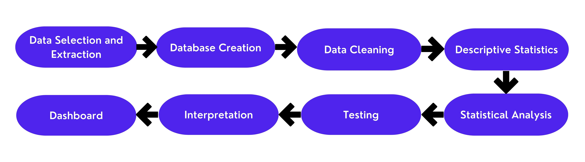

## Data Description

One noteworthy element of this data extract is that even though the data selected was to encompass the years of 2010-2021, when data extract was opened in RStudio (using the `range()` function), the data set only appeared to include data for 2010 until 2015. This is something that could be considered a potential limitation of using IPUMS as a data source, as there may be a risk of receiving incomplete data extracts. Besides that, it was expected in the creation of the extract that equal or at least representative amounts of data for all of the United States would appear in the extract, which was not the case, as was previously addressed in the Ethical Implications, Data Bias section. The goal of this study is to generate key findings for the entirety of the US, split by year, to attempt to capture how rates of educational attainment (based on other variables) change over time. Due to the aforementioned potential issues with the data, this study may result in findings that are not fully representative of the populations being captured within the data, though it should provide some key insights into the trends present in the US. It is unclear why this data is inaccessible or not included in the extract.

The raw data extract from IPUMS, before cleaning and transformation, looked much like the **Table 3**.

Table: Raw Data

| CPSIDP      | YEAR | ... | EDUC | FTOTVAL |
|:-------------|:------|:--------|:------|:---------|
| 2.00912E+13 | 2010 | ...      | 81   | 13992   |
| 2.00912E+13 | 2010 | ...      | 71   | 12000   |
| 2.00912E+13 | 2010 | ...      | 71   | 34814   |
| 2.00912E+13 | 2010 | ...      | 50   | 34814   |

In order to analyze the data properly, each variable was considered in relation to how it needs to be used in analysis. In the case of *CPSIDP*, the nature of the variable is to serve as an identifier variable for each person in the sample, made using a combination of the survey year, the unique identifier assigned each person from every household (captured in the data), and the survey month. This variable will not be considered in analysis because of the nature of the variable and because of the several instances of blank values in the data extract. Additionally, the *SERIAL, YEAR, PERNUM, BPL, INCTOT*, and *MONTH* variables are not be considered in the analysis. The *SEX* variable is a binary variable, taking in values of either 1 or 2, with 1 representing males and 2 representing females. The *STATEFIP* variable represents a qualitative nominal variable, which is one that is seperated into levels of no particular order, and specifies entries by state with a numerical code. EDUC is an ordinal variable, as the entries are sorted into numerical codes, each representing a level of education, in order.  For use in analysis, however, the *EDUC* variable is recoded into a binary variable that takes in a value of 0, indicating an educational attainment at or below some high school participation,  or 1, indicating an educational attainment at or above a high school diploma (or equivalent). *RACE* and *HISPAN* are also qualitative nominal variables, where each level of identification of race, and Hispanic ethnicity is assigned to a numerical code, in no particular order. Also for the purposes of use in statistical analysis, the RACE and HISPAN variables are recoded to create binary variables for each identity group captured within the variables. The full list of numerical code assignments is available on the IPUMS CPS official website. Although recommended by IPUMS, WTFINL and ASECWT are not be used for analysis, as there are some missing values present.

## **Descriptive Statistics**

For this study, **R** is the main tool used to perform data analysis, as such built-in functions such as `summary()` and `count()`, along with outside libraries and packages, are employed to perform the initial exploratory analysis and statistical analysis of the data.

After filtering the data to only include entries accounting for adults (18 and older in age), the amount of observations in the data sample dropped from 1,048,575 to 753,243 observations. Additionally, using R's built-in `count()` function, counts for the amount of individuals by race, gender, and Hispanic Heritage were generated for each year. These results can be observed below in **Tables 4-9** covering 2010 and 2015.

Table: 2010 Race Count

|Row number | RACE | n |
|:----------|:------------|:------------|
|1          |White        |117536       |
|2          |Black        |17809        |
|3          |Asian        |8072         |
|4          |Other        |2972         |
|5          |American Indian|1977         |
|6          |Pacific Islander|705          |

Table: 2015 Race Count

|Row number | RACE | n |
|:----------|:------------|:------------|
|1          |White        |18246       |
|2          |Black        |2258        |
|3          |Asian        |1570         |
|4          |Other        |289         |
|5          |American Indian|121         |
|6          |Pacific Islander|41          |

Table: 2010 Gender Count

|Row number | SEX | n |
|:----------|:------------|:------------|
|1          |Male        |71001       |
|2          |Female        |78070         |

Table: 2015 Gender Count

|Row number | SEX | n |
|:----------|:------------|:------------|
|1          |Male        |10651       |
|2          |Female        |11874        |

Table: 2010 Hispanic Heritage Count

|Row number | HISPAN | n |
|:----------|:------------|:------------|
|1          |Not Hispanic   |125188       |
|2          |Mexican        |14569        |
|3          |Other        |6086     |
|4          |Puerto Rican     |2233         |
|5          |Cuban          |995         |

Table: 2015 Hispanic Heritage Count

|Row number | HISPAN | n |
|:----------|:------------|:------------|
|1          |Not Hispanic   |19644       |
|2          |Puerto Rican    |958        |
|3          |Other        |866   |
|4          |Dominican    |515         |
|5          |Mexican        |317        |
|6          |Salvadoran        |136         |
|7          |Cuban          |89          |

This shows that the number of observations for each of these variables is inconsistent across years, suggesting that this data is only representative of a sample population.

When using `summary()` in order to generate summary statistics on the data set (filtered for entries where age is 18 and older), the following results are output. Only the results for the income and age variable are shown, as the remainder of the variables in the data set are either classified as qualitative nominal or ordinal, so the interpretation of these summary statistics is negligible for those variables.


Based on these summary statistics, across all of the data points in the extract, the minimum reported total family income was -19,998 and the max reported income was 2,742,997. For age, the minimum value was 18, while the max was 85.

For the initial exploratory analysis of the data, the main focus is to visualize how educational attainment varies by gender, race, and Hispanic ethnicity in the United States across 2010-2015. The goal is to use these to capture changes in rates of educational attainment across years, relative to the amount of observations available for each given year. To briefly preview the results for this component of the analysis, the following piecharts representing data for 2010 were generated to aid in descriptive analysis. The results from these plots can also be observed in the aforementioned results from using the count() function for each variable.

### Gender


### Race


### Hispanic Ethnicity


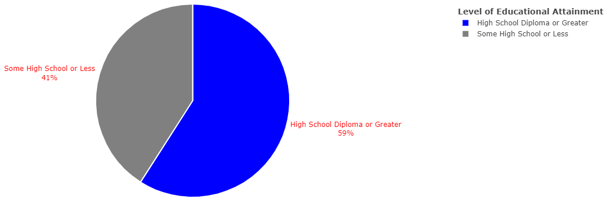


In the *Conclusion* section, these and visualizations for the following years are used to observe changes in educational attainment based on the aforementioned demographic indicators.

## Tools

As mentioned in the previous section, [`R`](https://www.r-project.org/about.html) is the primary tool used in the analysis of data. *R* is a free, open-source programming language, used for data manipulation, statistical computing, and high-quality graphics [@r]. This tool was selected to perform statistical analysis and generate visualizations due to the wide variety of different methods available within the language (either built-in or through outside packages). Along with the use of R, *RStudio* was employed as the main integrated development environment (IDE) for this project, as the use of both in conjunction made development of this project go more smoothly [@rstudio].

The raw data extract from IPUMS was too large to open in R Studio and as such, a separate database software was needed in order to support storing the data for use in a program. For this, *SQLite* was employed to serve as the database engine due to its relative ease of use. SQLite is a library written using C, that faciltates the use of an SQL database engine, which in the case of this project, allows for the analysis of larger datasets in languages such as Python or R [@sqlite].

### R Packages

The following section touch on the specific R packages that were utilized in the development and completion of this project

#### tidyverse

One of the packages used most prevalently throughout the project was [`Tidyverse`](https://www.tidyverse.org/), which is an integrated unit/distribution of sub packages, all with specific functionalities meant to support data analysis in a uniform way [@tidy]. In particular, the sub-package used in this project include dplyr. [`dplyr`](https://dplyr.tidyverse.org/) specifically supports the manipulation of a dataset in order to filter through data in order to extrapolate more specific information from other variables [@dplyr]. This allows any unneccessary information to be left out of the analysis, in order to focus on insights about the topics of interest. This project leverages the filter() and count() functions from the dplyr package to support data manipulation.

#### shiny and shinydashboard

In order to actually implement a data analysis dashboard, I chose to employ the use of [`shiny`](https://shiny.rstudio.com/) and [`shinydashboard`](https://rstudio.github.io/shinydashboard/) packages in tandem in order to support the development of an interactive web dashboard written in R [@shiny] & [@shinydash]. A nice feature of the packages are that they provide the structure for a standalone dashboard, while also executing the necessary code to fill the dashboard with visualizations and other relevant output for the project.

#### plotly

[`plotly`](https://plotly.com/r/getting-started/#:~:text=plotly%20is%20an%20R%20package,locally%20through%20the%20htmlwidgets%20framework.) is an R package that supports the creation of interactive graphs using the open-source graphing library written in Javascript, plotly.js [@plot]. This specific package was employed to embed an element of interactivity to the existing ggplot visualizations, specifically through letting users scroll over data points to see the exact reported values, as well as to zoom and pan over values in a relatively simple way.

#### RSQLite

[`RSQLite`](https://cran.r-project.org/web/packages/RSQLite/vignettes/RSQLite.html#:~:text=RSQLite%20is%20a%20DBI%2Dcompatible,library(DBI)) is a driver for R used to connect database interface (DBI) and database engine of SQLite to R [@rsql] & [@rsqlite]. Through the use of this package, the SQLite database created to house the data from IPUMS is accessible for use throughout the R code in the project. As this package was made to be compliant with the DBI package, many of the common functions employed throughout the project are available in both packages. These functions include dbConnect(), dbGetQuery(), and dbDisconnect(). dbConnect() is used to establish a connection to the SQLite database, while dbDisconnect() is used to close the connection after use. dbGetQuery() is used to fetch data from the database based on specifics provided in the query that's passed in as an argument to the function.

#### rsconnect and shinyapps.io

The `rsconnect` package allows Shiny web apps to be deployed and hosted on the cloud, using the [shinyapps.io](https://www.shinyapps.io/) service. In order to allow for ease of use and access of this tool, the project is deployed on shinyapps.io upon its completion [@shinyapps].

## Economic Theory

As an interdisciplinary project attempting to leverage computational applications with Econometric statistical techniques, the main model that used in the consideration of this project's goals is that of Human Capital Theory. **Human Capital Theory** (Schultz, 1961 [@schultz]; Becker, 1993 [@beck]; Mincer, 1958 [@mincer]) states that humans have the ability of increasing their productive capacity, along with their earning potential, through the attainment of higher levels of educational attainment and/or specialized skill training by public or private investment. Whenever individuals or public institutions invest more into education, the higher people's lifetime earnings, access to high-paying jobs, and reduced potential for unemployment become.

Core aspects of identity such as race, gender, and Hispanic ethnicity aren't considered within the framework of Human Capital Theory, as it doesn't consider the impact of systemic social inequity present in the form of institutional barriers and instead postulates that the only way of increasing your productive capacity is to invest in more education or training. Barriers to receiving more education and those that exist even despite an education include differences in social and cultural expectations, as well as, discrimination or bias on the basis of race or sex, and even at times both. These barriers, while not considered within the theory of Human Capital, are important considerations to make as these circumstances can drastically impact a person's productive capacity and/or level of education (which then feeds into their productive capacity). Prior research presented in the related works section supports the idea that race and gender, factors which are outside of the Human Capital Model, can be significant determinants of educational attainment. This project aims to prove this point by testing for a statistical relationship between the level of education a person receives and their race, gender, and Hispanic origin.

## **Statisitical Analysis**

As the response variable of interest for this study is educational attainment and the nature of the recoded *EDUC* variable's values are binary, the most appropriate method to determine a relationship to the explanatory variables of race, gender, and Hispanic ethnicity is through making use of an Binary Logistic Regression.

The initial binary logistic regression model takes the following form:

In this project, the regression considers the following odds.


$$Y_j = \begin{cases} 
      1 & \mbox{if } EDUC \leq j \\
      0 & \mbox{if } EDUC > j 
      \end{cases}$$


Where if EDUC is equal to 1, the odds of having an educational attainment of a high school diploma or greater are greater. If EDUC is equal to 0, the odds of having an educational attainment of some high school or lesser education are greater.

Then this is factored into the following regression for the project.

$logit(Y_j) = \beta_0 + \beta_1 \mathrm{GENDER} + \beta_2 \mathrm{RACE} + \beta_3 \mathrm{HISPANIC}$

Due to the fact that this model encompasses explanatory variables that are both binary and categorical in nature, further data manipulation was needed in order to convert these variables into ones that can be used to create interpretable and valid results within a regression model. The unique values for each of these variables are recoded into dummy variables to achieve this goal. There are two exceptions to this: firstly, in the RACE variable in that the mixed race categories represented in the data were merged to create a single mixed race category in order to also aid in simplifying the interpretation of the model's results. The code snippet below first shows the recoding of the individual mixed race groups values into a universal "catch-all" variable, while the following code snippet shows the recoding of the RACE variable into individual dummy variables.
 
 
 
 
**Mixed Race Grouping**

```R
# filtering
    result$RACE[result$RACE == "801"]<-"999" #white black
    result$RACE[result$RACE == "802"]<-"999" #white american indian
    result$RACE[result$RACE == "803"]<-"999" #white asian
    result$RACE[result$RACE == "804"]<-"999" #white pacific islander
    result$RACE[result$RACE == "805"]<-"999" #black american indian
    result$RACE[result$RACE == "806"]<-"999" #black asian
    result$RACE[result$RACE == "807"]<-"999" #black pacific islander
    result$RACE[result$RACE == "808"]<-"999" #american indian asian
    result$RACE[result$RACE == "809"]<-"999" #asian pacific islander
    result$RACE[result$RACE == "810"]<-"999" #white black american indian
    result$RACE[result$RACE == "811"]<-"999" #white black asian
    result$RACE[result$RACE == "812"]<-"999" #white american indian asian
    result$RACE[result$RACE == "813"]<-"999" #white asian pacific islander
    result$RACE[result$RACE == "814"]<-"999" #white black american indian asian
    result$RACE[result$RACE == "815"]<-"999" #american indian
    result$RACE[result$RACE == "816"]<-"999" #white black pacific islander
    result$RACE[result$RACE == "817"]<-"999" #white american indian pacific islander
    result$RACE[result$RACE == "818"]<-"999" #black american indian asian
    result$RACE[result$RACE == "819"]<-"999" #white american indian asian pacific islander
    result$RACE[result$RACE == "820"]<-"999" #mixed race, 2-3, unspecified
    result$RACE[result$RACE == "830"]<-"999" #mixed race, 4-5, unspecified
    
```
 
 
**Race Binary Recoding**

```R
# race
result$black <- ifelse(result$RACE == "200", 1, 0)
result$amer_indian <- ifelse(result$RACE == "300", 1, 0)
result$asian <- ifelse(result$RACE == "651", 1, 0)
result$islander <- ifelse(result$RACE == "652", 1, 0)
result$mixed_race <- ifelse(result$RACE == "999", 1, 0)
```

The same was done for the Other Hispanic population in the HISPAN variable, in which the Central and South American populations were merged with the Other Hispanic populations rates, in order to consolidate results, due to lower counts of all of these populations in isolation, relative to the other Hispanic races in the analysis. The code snippets for the merging of the Hispanic groups, as well as the binary recoding of the HISPAN variable can be observed below.

 
 
**Other Hispanic Group Merging**

```R
#other hispan filtering
result$HISPAN[result$HISPAN == "600"]<-"650" # other hispanic
result$HISPAN[result$HISPAN == "610"]<-"650" # central/south american
result$HISPAN[result$HISPAN == "611"]<-"650" # central american, excluding salvadorian
result$HISPAN[result$HISPAN == "612"]<-"650" # south american   
```
 
 
**Hispanic Ethnicity Binary Recoding**

```R
# hispanic
result$mex <- ifelse(result$HISPAN == "100", 1, 0)
result$pr <- ifelse(result$HISPAN == "200", 1, 0)
result$cuban <- ifelse(result$HISPAN == "300", 1, 0)
result$dom <- ifelse(result$HISPAN == "400", 1, 0)
result$salv <- ifelse(result$HISPAN == "500", 1, 0)
result$otherhispan <- ifelse(result$HISPAN == "650", 1, 0)  
```

Instead of using the original variables from the data, the newly created dummy variables are employed in order to run the regression. This then changes the regression model that is run to the following:


$logit(Y_j) = \beta_0 + \beta_1 \mathrm{FEMALE} + \beta_2 \mathrm{BLACK} + \beta_3 \mathrm{AMERICAN~INDIAN} + \beta_4 \mathrm{ASIAN} + \beta_5 \mathrm{ISLANDER} + \beta_6 \mathrm{PACIFIC~ISLANDER} + \beta_7 \mathrm{MIXED~RACE} + \beta_8 \mathrm{MEXICAN} + \beta_9 \mathrm{PUERTO~RICAN} + \beta_{10} \mathrm{CUBAN} + \beta_{11} \mathrm{DOMINICAN} + \beta_{12} \mathrm{SALVADORIAN} + \beta_{13} \mathrm{OTHER~HISPANIC}$


To run and store the results of running a binary logistic regression in R the `glm()` function from the stats package is utilized. To display the results of this regression, with information like coefficients and t-values, `summary()` must be used with the stored name of the regression. A code snippet displaying the aforementioned process of computing a regression in R is pictured below.

```R
# binary logistic regression model
m <- glm(EDUC~female + black + amer_indian + asian + islander + mixed_race + mex
 + pr + cuban + dom + salv + otherhispan, family = binomial, data = result)
```

Due to constraints in computing power and the breadth of the data used in this project, the binary logistic regression was run using a randomly selected sample population of 100,000 observations. This did not change the code for binary logistic regression much, only impacting the data source for the equation. The code for the sample construction and the subsequent changes to the binary logit are below.

```R
# sample data
sample_result <- result[sample(nrow(result), 100000), ]
    
# binary logistic regression model
m <- glm(EDUC~female + black + amer_indian + asian + islander + mixed_race + mex 
+ pr + cuban + dom + salv + otherhispan, family = binomial, data = sample_result)  
```

This regression tests the relationship between each of the explanatory variables to educational attainment. The coefficients of a binary logit are often hard to interpret on their own, so odds ratio is employed to aid in the interpretation of a statistical relationship between race, gender, and Hispanic origin to educational attainment.

To compute the odds ratio in R, the exp() and coef() functions were used in conjunction, taking in the stored variable representing the regression model as input. This line of code produces an output result of a value for each explanatory variable in the model, to be used when evaluating the results of the regression.

```R
## odds ratio for interpretation
exp(coef(m))
```

Additionally, in order to capture how Hispanics, the ethnic group of focus in this study, compare to other racial groups, an additional regression was constructed and run. This regression, like the previous one, looks at the odds of having an educational attainment of a completed high school education or higher. This model took the following form:


$logit(Y_j) = \beta_0 + \beta_1 \mathrm{FEMALE} + \beta_2 \mathrm{BLACK} + \beta_3 \mathrm{AMERICAN~INDIAN} + \beta_4 \mathrm{ASIAN} + \beta_5 \mathrm{ISLANDER} + \beta_6 \mathrm{PACIFIC~ISLANDER} + \beta_7 \mathrm{MIXED~RACE} + \beta_8 \mathrm{HISPANIC}$


In order to construct this additional binary logistic regression in R, the HISPAN variable was recoded to merge all of the Hispanic values together. This merged values was then recoded into a binary variable, taking in values of 0 (non-hispanic) or 1 (hispanic). The code snippets for the recoding of HISPAN, as well as the newly constructed regression are below.
 
 
**Hispanic Recoding**

```R
#hispan filtering
result$HISPAN[result$HISPAN == "000"]<-"0" # non hispanic
result$HISPAN[result$HISPAN == "100"]<-"650" #mexican
result$HISPAN[result$HISPAN == "200"]<-"650"#puerto rican
result$HISPAN[result$HISPAN == "300"]<-"650"#cuban
result$HISPAN[result$HISPAN == "400"]<-"650"#dominican
result$HISPAN[result$HISPAN == "500"]<-"650"#salvadorian
result$HISPAN[result$HISPAN == "600"]<-"650" # other hispanic
result$HISPAN[result$HISPAN == "610"]<-"650" # central/south american
result$HISPAN[result$HISPAN == "611"]<-"650" # central american, excluding salvadorian
result$HISPAN[result$HISPAN == "612"]<-"650" # south american 

# binary recode    
result$hispanic <- ifelse(result$HISPAN == "650", 1, 0)
```

**2nd Regression**


```R
m <- glm(EDUC~female + black + amer_indian + asian + islander + mixed_race 
+ hispanic, family = binomial, data = sample_result)
```

In order to get more interpretable results, the odds ratio was also generated for this regression.

The results of running the code for both regressions and subsequent odds ratios are as follows:
 
 
**First Regression and Odds Ratio**


**Second Regression and Odds Ratio**


The interpretation of these results is further elaborated on in the *Conclusions* chapter.

# Experiments

In this chapter, the experimental set up and evaluation for this project is presented, as to give a better understand of how the research questions are addressed and how their results are validated. Within this, the testing framework for this project is outlayed in order to explain the steps taken to guarantee that the results generated by this project are as accurate as possible.

## Experimental Design

For the experimental design of this project, experiments are separated into two main sections: *descriptive statistics* and *statistical analysis*.

The first half of experiments focus on outlaying the *descriptive statistics* for this project, consisting of evaluating plots, specifically the counts for the amounts of people under each category of race, gender, or Hispanic origin that achieved either a high school diploma or greater or some high school or lesser. Using these plots, the proportions of each population accounted for in the analysis is used to compare different gender, racial, and Hispanic ethnic subgroups to eachother. This hopefully targets several useful results to questions related to what group maintained the highest average level of educational attainment.

The components of the EduAttain dashboard related to the *descriptive statistics* portion of the project include:

- **Data & Description**: This page of the dashboard presents a table of the raw data set extracted from IPUMS, summary statistics relating to the age and amount of individuals captured in the data, project description, and a data key for the data table.


- **Gender x Educational Attainment**: This page of the dashboard presents pie charts that were generated for each survey year representing the proportion of each gender's population above or below a High School education, and interpretations of the plots that compare female and male educational attainment.

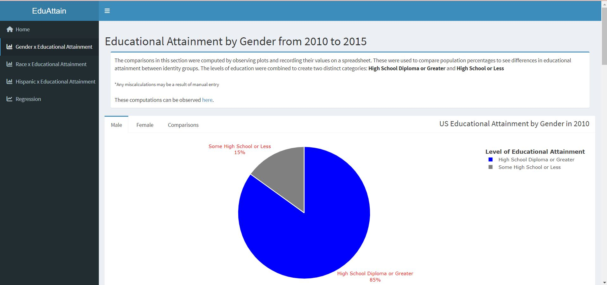

- **Race x Educational Attainment**: This page of the dashboard presents pie charts that were generated for each survey year representing the proportion of each racial population above or below a High School education, and interpretations of the plots that compare White, Black, Asian, American Indian, Pacific Islander, and Mixed Race educational attainment.


- **Hispanic x Educational Attainment**: This page of the dashboard presents pie charts that were generated for each survey year representing the proportion of each Hispanic population above or below a High School education, and interpretations of the plots that compare Non Hispanic, Mexican, Puerto Rican, Cuban, Other Hispanic, Dominican, and Salvadorian educational attainment.


The second section of experiments focuses on the *statistical analysis* of the data through the use of a binary logistic regression, as well as, an odds ratio. The regression and odds ratio are used in conjunction to determine the presence of a statistical relationship between educational attainment and race, gender, and Hispanic origin. The results from both determine how a person's gender, racial, or ethnic identity can impact the education an individual receives. In addition, a secondary binary logistic regression and odds ratio shed light on how the Hispanic ethnic group compares to other racial groups' educational attainment.

The components of the dashboard related to the *statistical analysis* portion of the project include:

- **Regression**: This page of the dashboard presents the results of the two binary logistic regressions and corresponding odds ratios computed for this project, along with interpretations from these figures.


## Evaluation

To evaluate this project, a couple different techniques are employed in order to test each component including the use of unit and UX testing, and the support of continuous integration through GitHub Actions. Unit testing is employed in the evaluation of the dashboard with the use of R's `testthat` in order to test the functionality of certain code segments including testing the creation of a plotly object, connection to the database using a query, and random sampling of the original data for the regression. Test cases look like the following test case that tests that the SQLite query returns the correct expected output. This and other test cases for the application are stored in /EduAttain/tests/app_tests.R in the source repository:

```R
# Test that the data is queried correctly
test_that("SQLite query returns expected output", {

    # install necessary libs
    library(testthat)
    library(DBI)
    library(RSQLite)
    library(plotly)
    library(shiny)
    library(shinydashboard)
    library(shinytest)
    
    # setting database path -- via USB
    db <- "C:/Users/kyrie/Documents/cs600/EduAttain/EduAttain/data/CPS.db"
    
    # connect to database
    conn <- dbConnect(RSQLite::SQLite(), dbname = db)

    # query
    result <- dbGetQuery(conn,"SELECT cpsidp, sex, educ, race, hispan, age 
    FROM CPS WHERE age >= 18 AND cpsidp !='CPSIDP'")

    # check if result is data frame
    expect_true(is.data.frame(result))

    # disconnect from sqlite db
    dbDisconnect(conn)
})
```

To run the test, the IDE used for this project provided a button when the test file was open to run the tests automatically. To run it using the console, the command that could be used is `test_file("/EduAttain/tests/app_tests.R")`. When the test file is run, all the tests pass, albeit with warnings related to the version of R that the dependency packages were installed under.


For the evaluation of the accuracy of the generated regression output, a confusion matrix, specifically the accuracy computed by the confusion matrix, validates the output generated by the `glm()` function for the binary logistic regression. The *confusion matrix* looks at the accuracy of the model by determining the amount of observations that were prediced that did have an education of a high school diploma or greater and comparing those to the predicted values generated from the same data set. These observations are separated into true positives (TP), true negatives (TN), false positives (FP), and false negatives (FN), which account for the predictions and their outcomes. If the outcome that was predicted was true, it is a true positive/negative and if it is false, it is a false positive/negative. Both true negative and true positive check for those observations that were predicted to have an education of some high school or less. Accuracy is computed from this confusion matrix following the equation below.


$accuracy = \frac{TP + TN}{total}$


To construct the confusion matrix and get the accuracy of the binary logistic model being run, the following steps were taken after running the regression:

```R
# binary logistic regression model
    m <- glm(EDUC~female + black + amer_indian + asian + islander + mixed_race 
    + hispanic, family = binomial, data = sample_result)
    
    # obtain predictions
    predict <- predict(m, type="response")
    predict_class <- ifelse(predict > 0.5, "Yes", "No")
    
    # confusion matrix
    cm <- table(predict_class, sample_result$EDUC)
    
    TP <- cm[1,1]
    TN <- cm[2,2]
    
    accuracy <- (TP+TN)/sum(cm)
    cat("Accuracy: ", round(accuracy,4))
```

The accuracy generated by the first regression run for this project, **$logit(Y_j) = \beta_0 + \beta_1 \mathrm{FEMALE} + \beta_2 \mathrm{BLACK} + \beta_3 \mathrm{AMERICAN~INDIAN} + \beta_4 \mathrm{ASIAN} + \beta_5 \mathrm{ISLANDER} + \beta_6 \mathrm{PACIFIC~ISLANDER} + \beta_7 \mathrm{MIXED~RACE} + \beta_8 \mathrm{MEXICAN} + \beta_9 \mathrm{PUERTO~RICAN} + \beta_{10} \mathrm{CUBAN} + \beta_{11} \mathrm{DOMINICAN} + \beta_{12} \mathrm{SALVADORIAN} + \beta_{13} \mathrm{OTHER~HISPANIC}$**, is as follows.


This means that this binary logit's results are 86.5% accurate.

The accuracy generated by the second regression run for this project, **$logit(Y_j) = \beta_0 + \beta_1 \mathrm{FEMALE} + \beta_2 \mathrm{BLACK} + \beta_3 \mathrm{AMERICAN~INDIAN} + \beta_4 \mathrm{ASIAN} + \beta_5 \mathrm{ISLANDER} + \beta_6 \mathrm{PACIFIC~ISLANDER} + \beta_7 \mathrm{MIXED~RACE} + \beta_8 \mathrm{HISPANIC}$**, is as follows.


This means that this binary logit's results are also 86.5% accurate.

In addition to the unit testing, the data dashboard's functionality is evaluated according to the following table to perform user experience (UX) testing:

Table: Components to Test on Dashboard - UX Testing

|Row number | Component | Check |
|:----------|:------------|:------------|
|1          |Menu Button works        |$\checkmark$        |
|2          |Raw Dataset is Generated       |$\checkmark$        |
|3          |Collapsible Windows work        |$\checkmark$        |
|4          |Links on pages work       |$\checkmark$        |
|5          |Every Tab can be Accessed        |$\checkmark$        |
|6          |6 graphs generated for each subtab, except reg |$\checkmark$        |
|7          |6 tables generated for each subtab, except reg |$\checkmark$        |
|8          |Regression, odds ratio, and confusion matrix results are generated   |$\checkmark$        |

For each of the components listed, the functionality is tested as to simulate a user testing and to make sure that every piece of the dashboard is working as it should be. Specifically, certain buttons are clicked on and certain output is checked to test for completion. This is to ensure that the user experience of EduAttain provides a platform that is easy to use and access.

## Threats to Validity

Existing threats to the validity of this project include the aforementioned problems of data reliability brought on by the issues with extraction of the data from the IPUMS site. Additionally, the use of various outside packages and libraries in the project may threaten the validity of the project's results, as whatever is output is dependent on these libraries working properly.

Related to this are the threats presented by the way the data was filtered and cleaned for this project. Specifically for the Hispanic, Other Hispanic, and Mixed Race populations, having merged certain populations together may result in inaccurate interpretations of their rates of educational attainment. Additionally, data may have been incorrectly filtered by year or by identity group being observed when constructing the plots, which may result in one population's educational attainment misrepresenting a different population's rates.

One of the additional threats to validity, presented by the content of this chapter, revolves around the limited nature of testing for the dashboard. While unit testing, observational testing, and continuous integration through GitHub Actions are employed as methods of testing the content presented in EduAttain, the actual testing functionality is rather limited. For unit testing, the only components being tested are that a plotly object is generated, the database is correctly queried and saved as a data frame, and that the random sample generation is accurate. The limited nature of unit testing is as a result of time constraints and lack of the use of reactive content in the dashboard of which to test.

In order to mitigate these threats, much of the code used throughout the project, specifically for the plots, was reexamined and run thoroughly for any syntax errors or differences in output. The inadequacies of the unit testing are supplemented by the inclusion of additional testing techniques including the use of observational testing and continuous integration.

# Conclusion

This chapter covers the results of the descriptive and statistical analysis presented in **EduAttain**, while covering opportunities for future work and any future ethical implications and recommendations.

## Summary of Results

The summary of results are separated into two main sections, Descriptive Analysis and Statistical Analysis, where the results generated by the dashboard are interpreted and discussed at length. These results provide insight into how EduAttain addresses the gaps in research in the realm of educational disparities based on gender, race, and ethnicity.

### **Descriptive Analysis**

#### **Gender and Educational Attainment: Results**

The results of the descriptive analysis presented in the Gender and Educational Attainment dashboard page showcases that, across all survey years, women had a higher proportion of individuals reporting an education of a High School Diploma or above. This result was achieved by comparing the percentage of those in the male and female population who had either an equivalent high school education or greater or less than some high school or below for each year. The plots showing the breakdown of educational attainment by men and women in this sample are depicted in **Figures 22-32**.


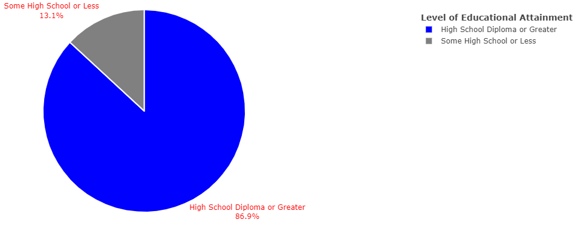

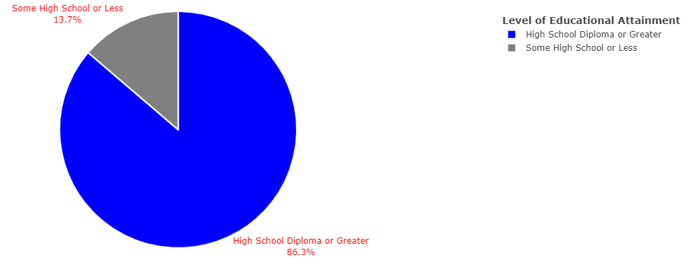


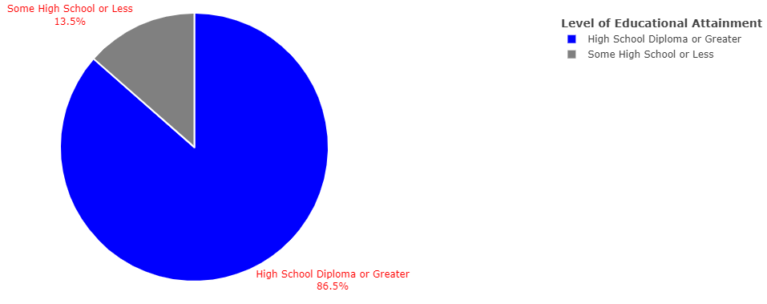


#### **Race and Educational Attainment: Results**

Within the Race and Educational Attainment page of the dashboard, the following plots were generated in order to show which racial group had the highest proportion of individuals reporting an educational attainment of a high school diploma or greater. While there were some general trends present across all years, there was also a slight variability in the trends that makes it relevant to present the results by year. These trends can be observed in **Figures 34-69**

##### Educational Attainment by Race in 2010


In 2010, the population with the highest proportion of individuals who attained an education equivalent to or above high school level was the Asian population, followed by the attainment of the White, Mixed Race, Pacific Islander, Black, and American Indian populations, in order.

##### Educational Attainment by Race in 2011

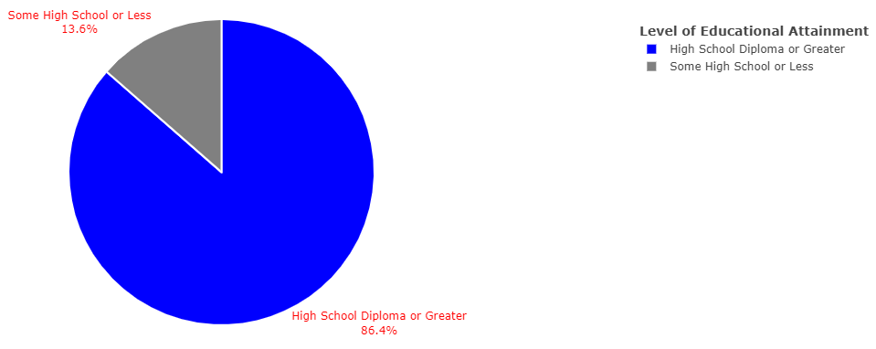


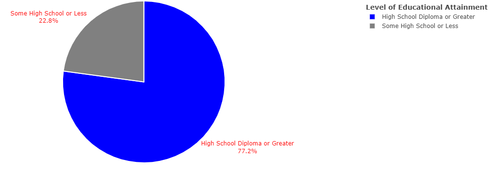

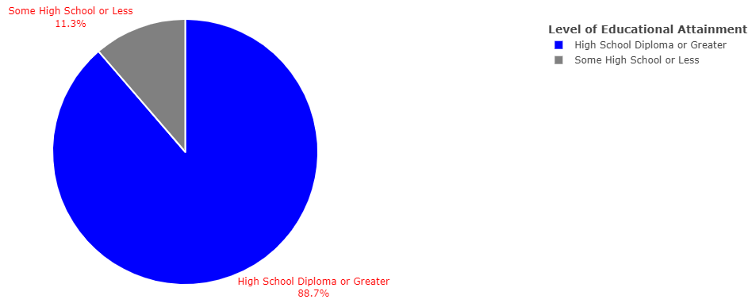

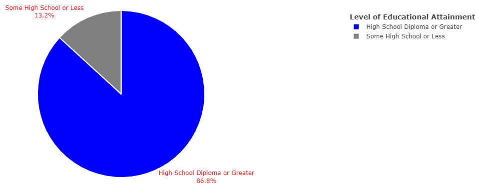

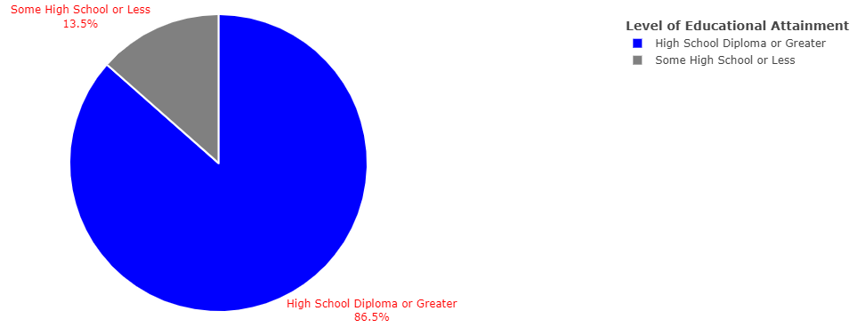

In 2011, the population with the highest proportion of individuals who attained an education equivalent to or above high school level was the Asian population, followed by the attainment of the Pacific Islander, Mixed Race, White, Black, and American Indian populations, in order.

##### Educational Attainment by Race in 2012

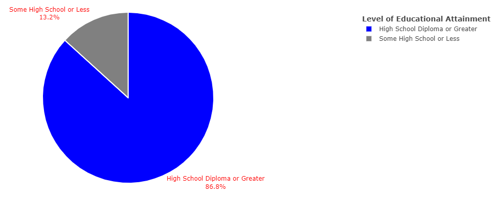


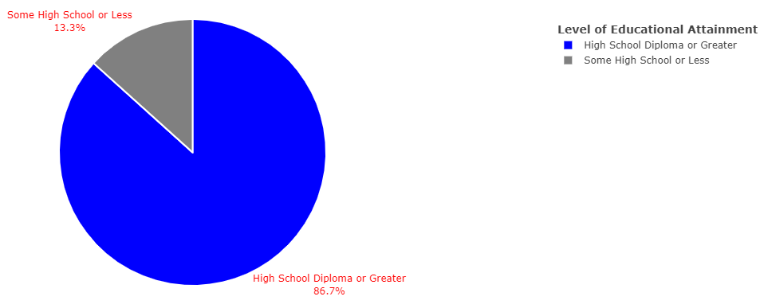

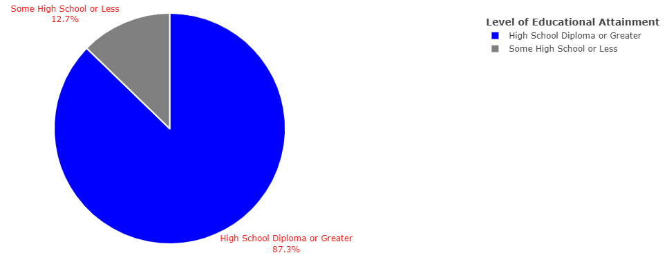

In 2012, the population with the highest proportion of individuals who attained an education equivalent to or above high school level was the Asian population, followed by the attainment of the Mixed Race, White, Pacific Islander, Black, and American Indian populations, in order.

##### Educational Attainment by Race in 2013

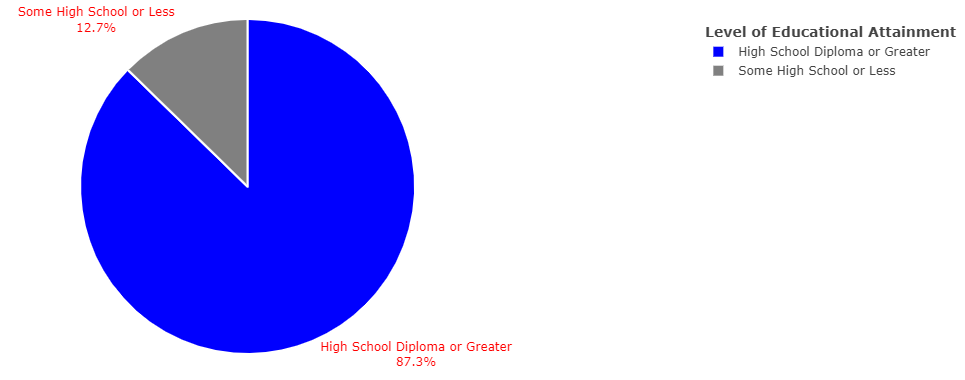


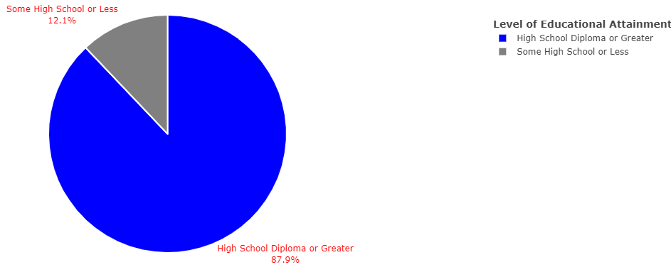


In 2013, the population with the highest proportion of individuals who attained an education equivalent to or above high school level was the Asian population, followed by the attainment of the Mixed Race, White, Pacific Islander, Black, and American Indian populations, in order.

##### Educational Attainment by Race in 2014

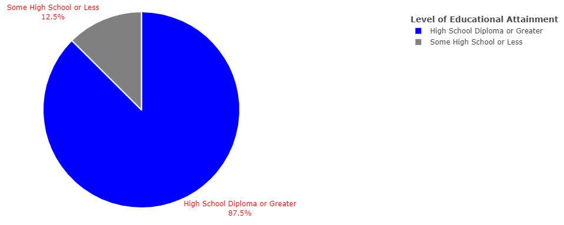


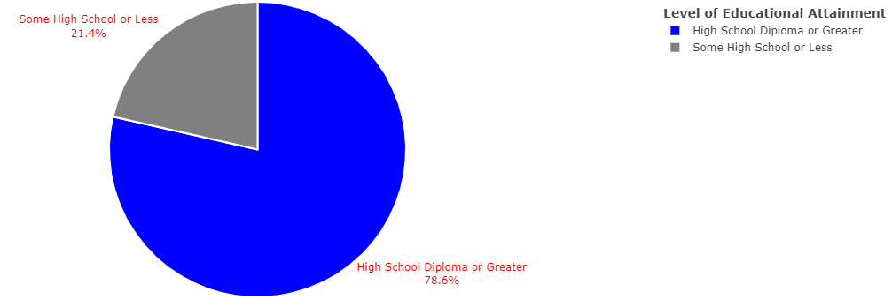

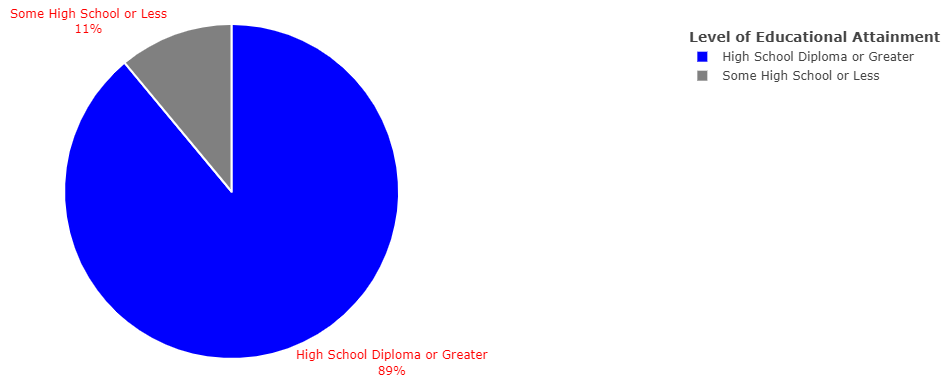

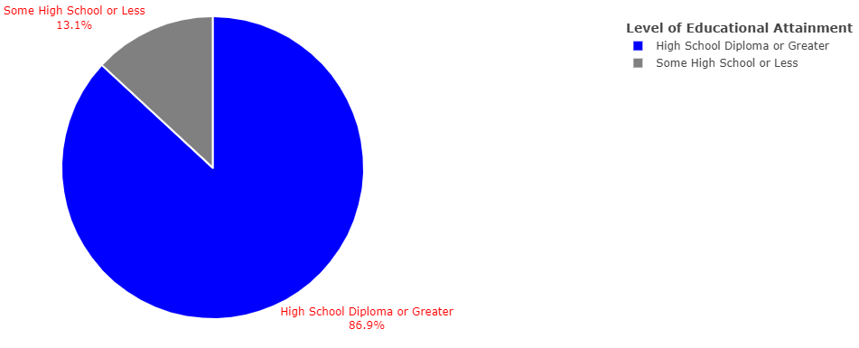

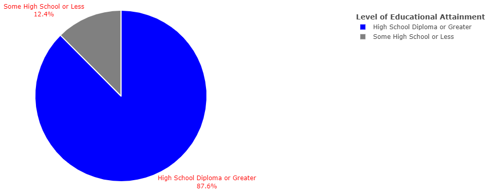

In 2014, the population with the highest proportion of individuals who attained an education equivalent to or above high school level was the Asian population, followed by the attainment of the Mixed Race, White, Pacific Islander, Black, and American Indian populations, in order.

##### Educational Attainment by Race in 2015


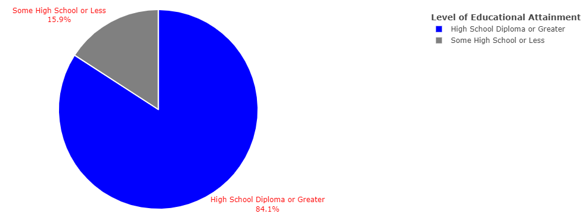

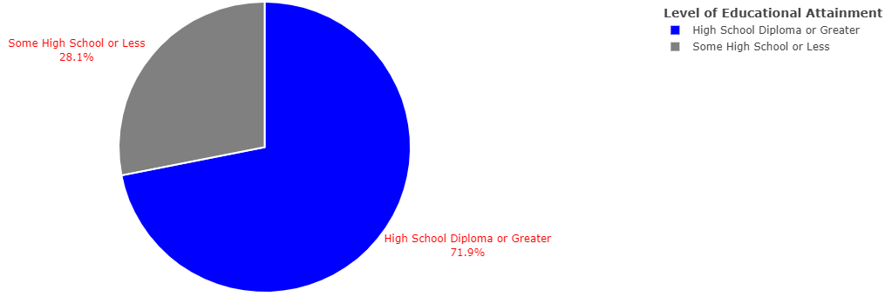


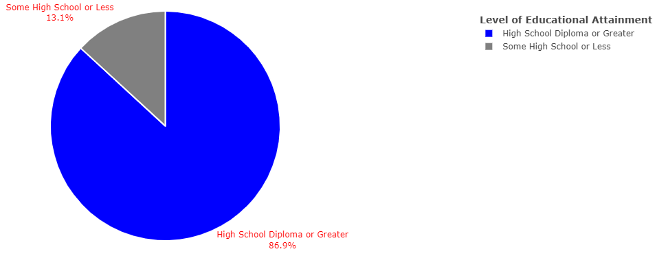

In 2015, the population with the highest proportion of individuals who attained an education equivalent to or above high school level was the White population, followed by the attainment of the Asian, Mixed Race, Pacific Islander, Black, and American Indian populations, in order.

Across all survey years, certain results from the data were the same including that Black and American Indian populations in the US tend to have the lowest rates of educational attainment when compared to other racial groups. The aspect that differed the most from year to year was what populations had higher rates of educational attainment.

The results from 2010-2014 show that the Asian population had the highest proportions of individuals who had completed an education of high school or greater, while in 2015, the largest proportion was accounted for in the White population. Additionally, in 2010, the White population was trailing the Asian population for the highest proportions of high school and college educated individuals, in the years to follow, the White population's proportion of these educated individuals fell behind the rates of both the Pacific Islander and Mixed Race populations.

Overall, the biggest takeaways from this section covering racial differences in educational outcomes are that the Asian population tends to lead in rates of having a high school education or higher, followed closely by the Mixed Race, Pacific Islander, and White populations. The populations with the lowest proportions of high school and college educated individuals include the Black and American Indian populations, with American Indian educational attainment falling below that of Black educational attainment for all survey years in this study. The most surprising outcome presented here is that the Mixed Race population had a higher recorded proportion of educated individuals than the White population, which brings into question how the intersection of membership in different racial groups could influence educational attainment.

#### **Hispanic Ethnicity and Educational Attainment: Results**

Within the Hispanic Ethnicity and Educational Attainment page of the dashboard, the following plots were generated in order to show which Hispanic ethnic subgroup had the highest proportion of individuals reporting an educational attainment of a high school diploma or greater. Much like in the previous section, there were some general trends present across all years, but enough variability in them that make it relevant to present the trends by year. One limitation that is important of the  results presented here is the lack of available data present for the Salvadorian and Dominican populations for years 2010-2013, since that specific data was not collected prior to 2014. This is where much of the variability in the trends comes from, since it changes what group has the lowest rates of educational attainment.

##### Educational Attainment by Hispanic Subgroup from 2010-2013

From 2010 to 2013, the population with the highest proportion of individuals with a completed high school education or greater was the Non Hispanic population. Within the Hispanic ethnic group, the highest attaining subgroup was the Cuban population, followed by the Puerto Rican and Other Hispanic populations. The population with the lowest proportion of high school and college educated individuals was the Mexican population. The plots used to come to this conclusion are presented in **Figures 70-89**.


##### Educational Attainment by Hispanic Subgroup from 2014-2015

From 2014 to 2015, with the inclusion of data for Dominican and Salvadorian populations, the population with the highest proportion of individuals with a completed high school education or greater was the Non Hispanic population. Within the Hispanic ethnic group, the highest attaining subgroup was the Cuban population, followed by the Puerto Rican, Other Hispanic, Dominican, and Mexican populations, in order. The population with the lowest proportion of high school and college educated individuals was the Salvadorian population. The plots used to come to this conclusion are presented in **Figures 90-103**.


Across all survey years, the proportions of high school and college educated individuals within the Non Hispanic, Cuban, Puerto Rican, and Other Hispanic populations, as well as their positions relative to each other, remained relatively constant. The only differences in the data were as a result of the inclusion of Salvadorian and Dominican data points, which made Salvadorians the Hispanic subgroup with the lowest levels of academic achievement. Though, these results may be skewed, as a result of fewer data points that were available to work with across all the survey years looked at in this study.

Of the results presented in this section, the most interesting is that of how the findings for the Dominican and Salvadorian populations and how they compare to other Hispanic ethnic subgroups. The literature referenced for this study failed to take into account the educational attainment of these populations, which makes these findings all the more interesting. Outside of that, the findings presented in this section related to the Cuban and Mexican Hispanic subgroups solidifies the research done previously.

### **Statistical Analysis**

#### **First Regression, Confusion Matrix Accuracy, and Odds Ratio**


The results of the first regression, Figure 112, show that all of the explanatory variables included in the model are statistically significant, given their p-values. This statistical significance can also be observed by looking for those results followed by an asterisk. Statistical significance refers to the presence of a non-random relationship between two or more variables determined by the p value of each variable (outside of the dependent variable), which is a value that indicates the probability of statistical significance. The  p-value is also the same value as the significance level, which is then used to compute the confidence level which is just 1 minus the significance level. Typically and in this project, the confidence level is 95% and the significance level is 5% or 0.05.  

The regression output of the first logistic regression, Figure 112, starts with a call to the model for this regression using the `glm()` method. Then the distribution of the deviance residuals are output, which are residuals used in generalized linear models to measure the difference between the predicted probability and the observed probability of each outcome, and to assess the fit of the model. For each deviance residual output for the minimum, first quarter, median, third quarter, and maximum values, the deviance residuals are minimally different than the predicted probabilities for this regression, so the model proves to be a good fit. Next, the coefficient estimates of the intercept and each of the individual variables in the model are output, which indicate the effect that each independent variable has on the dependent variable. As the coefficients estimated and output are a log of the odds being tested in the regression, direct interpretation of these values is not fully relevant to this project, as the odds ratio will provide a more cohesive interpretation of the coefficients, as they will be exponentiated in order to return the odds of each variable of attaining a certain outcome. However, the coefficient estimates generally provide an idea of the strength, magnitude, and direction of a statistical relationship between the dependent variable and each of the independent variables. In addition to the coefficient estimates, the standard errors (measuring the accuracy of the representation of a population in a sample), z-values (measuring a single value's relationship to the mean group of values from the source data, in terms of standard deviations to determine if the data is typical or atypical), and p-values (determining presence of non-random, statistically significant relationship) will be output. Given the p-value output for each of the independent variables and evaluating on the basis of if the p-value is less than or equal to 0.05, all of the variables are statistically significant. This is also indicated by the significance codes attributed to each of the results, denoted by one or more asterisks. The significance codes legend is also output as to give more context into the strength of the statistical significance of a specific variable and generally the more asterisks that accompany the p-value, the smaller the effect on the outcome variable. In this output, the p-values while all indicating statistical significance, also mostly all convey only slight statistical significance at the 0 level, with only the mixed_race variable being statistically significant at the 0.05 level. This indicates that only the mixed_race variable appears to make the most significant effect on the outcome variable while all of the other variables impact the EDUC variable minimally. Next, the null and residual deviances are output, which provide some context into the goodness of the fit of the model as well as to measure how the independent variables explain the variation of the response variable. Given the values output for the null and residual deviances, the model without the inclusion of any predictor variables and featuring just the intercept explains very little of the variance of the EDUC variable, while in contrast, the fitted model including the predictor variables explains more of the variance in EDUC than the null model. The last two components output in the regression summary include the Akaike Information Criterion (AIC) and the number of Fisher Scoring Iterations. The AIC value output in Figure 112 indicates that the model is a good fit to the data and the Fisher Scoring Iterations score output indicates that the estimates output by the model are likely to be reliable.

In order to look at the accuracy of the results, a confusion matrix of values was constructed in order to compute the accuracy of the model. Given the accuracy result depicted in Figure 105, the accuracy of the first binary logit's results were 86.5% accurate.


In order to actually interpret how the explanatory variables impact the response variable, EDUC, an odds ratio was employed to show each identity group's likelihood of completing an education of high school or greater, relative to the male, White, and Non Hispanic populations.


Odds ratios are evaluated based on the value of 1 where if a value falls above 1, higher odds are implicated and if a value falls below 1, lower odds are implicated. In interpreting the odds ratio for the first regression, Figure 106, the only group to have a higher odds of having an educational attainment of high school completion or higher, relative to the male reference population, was the female population.

When compared to the White reference population, all other racial groups had a lower odds of having a completed high school or college education, albeit at varying rates. Following the odds of attainment for White individuals is that of the Mixed Race, Asian, Pacific Islander, Black, and American Indian populations, in order.

Looking at the odds ratios for the Hispanic populations shows that all Hispanic ethnic subgroups had a lower odds of having completed high school or college compared to the Non Hispanic population. Following the odds of attainment for Non Hispanic individuals is that of the Salvadorian, Cuban, Puerto Rican, Dominican, Other Hispanic, and Mexican populations, in order.

#### **Second Regression, Confusion Matrix Accuracy, and Odds Ratio**

In the interest of capturing how the Hispanic ethnic group compared to other racial groups in the realm of educational attainment, a secondary regression was constructed. The results of this regression are presented in Figure 107.


According to the results presented in Figure 107, all explanatory variables included in the model are statistically significant relative to the response variable, educational attainment. A confusion matrix and subsequent accuracy was computed for this model, depicted in Figure 108.


Much like with the previous regression, an odds ratio was needed in order to aid in interpretation of the model, specifically in understanding the odds of each population completing a high school education or higher. These results are depicted in Figure 109.


According to Figure 109, the female population maintained a higher likelihood of completing an education of high school or above, relative to the male population. Conversely, all racial and ethnic groups had a lower likelihood of completing a high school education or greater, relative to the White, Non Hispanic population.Of these results, the most interesting is that the Hispanic population has the lowest odds of completing an education of high school or above, which affirm that Hispanics are the lowest attaining population as opposed to the American Indian or Black populations, as is commonly thought.

## Future Work

In future iterations of this study, there are several improvements that could be made in order to maximize and improve the findings produced. Firstly, the inclusion of other factors relevant to the study of educational disparities in the analysis would help further explain the implication of different intersections of identity on educational outcomes. Namely, the inclusion of an income variable would help explain how race, ethnicity, gender, and class intersect and impact educational outcomes. Additional findings could be teased out by also including variables that account for nativity and parental education, due to their impacts on educational outcomes, as covered in previous scholarship.

Additionally, the data in this project could be filtered by race, ethnicity, and gender, in that male and female educational attainment are studied in isolation based on the factors of race and ethnicity. This would be able to explain how gender and race/ethnicity both impact educational attainment, in order to figure out if the advantages of the general female population are true when divided up by race/ethnicity.

In regards educational attainment, the variable could have been recoded in a way that looked at the likelihood of completing a college education by filtering the educational levels in the data into a high school education  and below group and a college education and above group. This suggested recoding would have provided more insight into the differences in college completion amongst the identity groups in the data.

Lastly, improvements can be made to the implementation of the binary logistic regressions used in this project through the use of an increased sample size or the entirety of the data. The current results presented by the regressions could be misleading as a result of the limited nature of using a sample size, so using the entire data or increased sample size should mitigate these potential issues.

## Future Ethical Implications and Recommendations

Future ethical implications of EduAttain include the static nature of the dashboard application as well as the implementation of the confustion matrix. In relation to the nature of EduAttain, as the information presented in the tool uses specific data from specific years, the findings from this project may become outdated in coming years, especially if there are shifts in the rates of educational attainment within the populations studied in this project. This presents an ethical concern as the findings presented are confined to the data that the project was developed with and as time passes, the conclusions drawn may not always hold to be true, causing misinformation about a specific population's rates of educational attainment. A recommendation to resolve this would be to expand the project to include data after 2015 or to allow the ability for the inclusion of more data by a user.

Additionally, the confusion matrices used in this project to calculate the accuracy of the regressions may result in inaccurate results due to how they were implemented in the project. The recommended implementation of a confusion matrix involves separating the original data into a training and testing set, using the training set for the the regression and the testing set to project the predicted probabilties. Then the training and testing sets are compared against each other to construct the confusion matrix of true positives and negatives, and false positives and negatives, which are then used to compute the accuracy. Instead of following the recommended implementation, due to being limited to working with a sample size within the regression, the confusion matrix was constructed using the same sample size, instead of separating data into train and test sets. This presents an ethical concern due to the computed accuracy's potential for unreliability, meaning that the regression model constructed could be more or less accurate than what was actually projected in the original implementation of the confusion matrix accuracy. To resolve this issue, working on a machine with more computing power should allow for a regression to be run using the entirety of the data, so as to be able to divide up this data into testing and training sets for use in the construction of a regression and confusion matrix.

## Conclusions

Disparities in educational outcomes based on differences in gender, racial, and Hispanic ethnic identity were explored in detail within EduAttain.

The findings within the descriptive statistics section of the project match much of what has been previously established about gender, racial, and ethnic inequalities in education. Comparisons of piecharts showed that the female, Asian, Non Hispanic, and Cuban populations had the highest proportions of high school and college aged individuals, which matches the literature. Outcomes of interest from comparing these plots include that the Mixed Race population had a higher proportion of high school and college educated individuals than the White population. Furthermore, the findings for the Dominican and Salvadorian populations add to the gaps present in the literature for these Hispanic ethnic subgroups. Within the Hispanic population, the highest proportion of individuals with a high school diploma or greater was the Cuban population, followed by the  Puerto Rican, Other
Hispanic, Dominican, Mexican, and Salvadorian populations, in order.

The statistical analysis presented in this project also contributes new findings to the study of educational inequality. The results produced by the first regression point to a statistically significant relationship between educational attainment and the factors of gender, race, and Hispanic ethnicity. In looking at the odds of attaining a high school education or greater using an odds ratio, the female population had a higher odds of attaining this level of education compared to the male population. The odds for the racial comparisons shows that, when compared to the White population, all other racial groups had a lower odds of having a high school education or greater, which contrasts findings in the literature. The Hispanic comparisons showed that, when compared to the non Hispanic population, all Hispanic ethnic subgroups had a lower odds of having an education of high school or greater, matching the findings in the literature. The second binary logit compared the entire Hispanic population to other racial groups and found that Hispanics had the lowest odds of having an educational attainment at or greater than high school level, supporting the findings presented in prior research.

This project successfully bridges the gap in the study of gender, racial, and ethnic inequality in education by providing new insight into specific populations not previously captured and validating the findings of previous research in this field.

# References

::: {#refs}
:::
