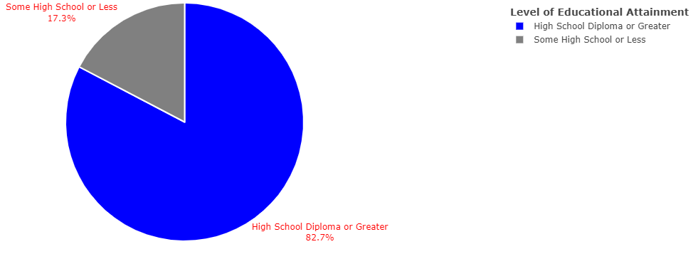
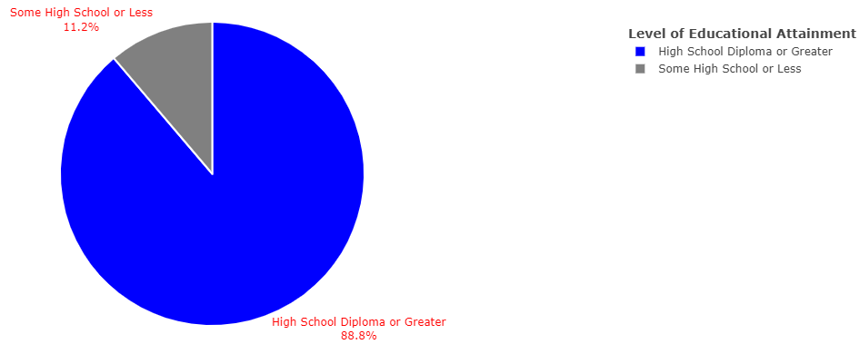
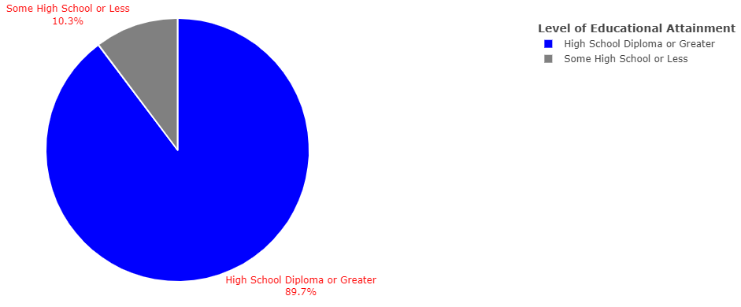
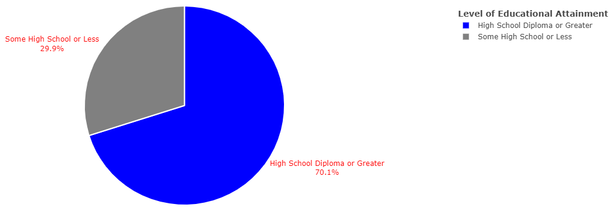

# Introduction

This chapter will introduce the existing research behind EduAttain, as well as, detail the motivation and goals of the project.

## Motivation

The US Census Bureau defines educational attainment as the highest level of education that an individual completes. Studying educational attainment is important because the level of education a person attains is oftentimes directly linked to the professional, personal, financial, and social opportunities available to a person [@holtz-eakin]. For example, a person with a lower level of educational attainment may not have access to job opportunities that require a high level of education. Or in contrast, a person with a high level of education may have access to opportunities and resources resulting from a higher social or financial status. Additionally, individuals with a bachelor's degree tend to earn higher wages, have longer life expectancies, and increased intergenerational mobility than those that do not [@dyer].

An individual’s educational attainment is likely to be impacted by differences in race, gender, and ethnicity [@darling-hammond],[@buch], & [@dyer]. Such demographic factors influence how an individual’s personal expectations, limitations to access, and accessibility to informational resources informs the decision to pursue greater educational opportunities, such as a postsecondary education. The main goal of this research is to determine to what degree these demographic factors play a role in determining an individual’s level of educational attainment.

Research shows that differences in educational attainment by gender have varied greatly over the last century, as initially the trends appeared to be favorable to men but by 1982, women started to lead in rates of enrollment and graduation from high school and college [@buch], [@jaco], [@dipre], & [@gamo]. These gendered differences in educational attainment have various causes including gender expectations towards receiving a higher education, accessibility to education, opportunities available post-graduation, and personal aspirations in completing some form of postsecondary education [@buch], [@jaco], & [@dipre]. The gender disparities in educational attainment also intermingle with racial and ethnic disparities as there are different historical trends between each racial and ethnic group and the dispersion of educational attainment also plays out differently for each group [@dipre].

Race also plays a role in determining the level of education a person completes, or at least it has for the better half of the last century [@dipre], [@darling-hammond], [@gamo]. This results from the opportunities available to different racial groups to access education and the ease of accessing it. Historical events and trends have also exacerbated the racial disparities in educational attainment such as the lingering effects of slavery and segregation [@dipre], [@darling-hammond], [@gamo].

In addition to racial disparities in educational attainment, there are also notable effects that an individual's ethnic background has on determining educational outcomes. The dispersion of rates of educational attainment amongst different ethnic groups differs greatly based on subgroup, which can skew the rates of the entire ethnic group due to certain factors that put a particular ethnic subgroup at a greater disadvantage from the beginning of an individual's educational trajectory [@dyer] & [@schneider]. These ethnic inequalities in education have many of the same causes as racial inequalities, including but not limited to, being more likely to come from a low-income or first generation household, which lowers the likelihood of being able to access to adequate informational resources and academic enrichment targeted towards college preparation [@dyer], [@aud], [@kao], & [@schneider]. Additionally, for certain racial and ethnic groups, factors such as citizenship, cultural expectations, and social attitudes shape the educational outcomes of these populations [@dyer], [@aud], [@kao].

## Current State of the Art

There is a robust literature surrounding educational attainment that captures the role of gender, race, and ethnicity. A focus in much of this literature is the gendered differences in educational attainment, which is a well-documented issue overall [@buch], [@jaco], [@dipre]. These gendered differences show that while there was at some point a male-leaning dominance in the levels of educational attainment, women now exceed men in rates of educational attainment, especially post secondary education [@buch], [@jaco], [@dipre]. However, this gender gap reversal does not reflect a reversal in the gender gap as it relates to occupations or wages, according to the literature [@gmao].

Much of the focus in the existing literature concerns differences between white and black individuals. This neglects the disparities and differences in educational attainment that might be observed in other racial and ethnic groups. One of the goals of this study and subsequent tool is to analyze differences across different racial and ethnic groups, with special interest in observing differences in those racial and ethnic groups that literature has failed to cover in detail.

To my knowledge, there is no research that analyzes the combined impact of race, ethnicity, and gender on educational attainment and the degree to which interactions between these factors can influence whether a person will recieve a certain level of educational attainment. This gap in research is particularly concerning given the impact on these intersections of identity on educational outcomes.

None of the studies referenced in the development of this project employed the use of regression to study the effects of different factors on educational attainment. One of the goals of this project is to use a regression model to capture how race, Hispanic ethnicity, and gender explain differential trends in educational attainment. This research shed light on the strength of the relationship between each of the factors. It could also help determine which of these factors plays a bigger role as a determinant of educational attainment.

This project also looks to take on the task of an interdisciplinary study, as research from various fields of study including Sociology and Economics will be leveraged in the creation of a tool that is created using computer science and data science fundamentals. The goal is that this project represents a type of study called Computation Social Science Fusion Analysis, where multiple disciplines are used together in order to analyze data and draw greater conclusions from that data (had only traditional data analysis been employed) [@kauf] & [@jing].

## Goals of the Project

EduAttain addresses racial, ethnic, and gender inequalities in educational attainment in the United States through the use of interactive visualizations and statistical analysis by way of a binary logistic regression. This project leverages data from Integrated Public Use Microdata (IPUMS) Current Population Survey (CPS) microdata, which is harmonized to include relevant demographic information about the US population. The data itself is cross-sectional, encompassing years 2010-2015 in the United States. Specifically, the variables in the data extract, created using IPUMS’ platform, include the survey year (YEAR), state identified by FIPS code (STATE), age (AGE), sex (SEX), race (RACE), Hispanic origin (HISPAN), educational attainment code (EDUC), total family income (FTOTVAL), birthplace (BPL), and total personal income (INCTOT). Additional variables were included in the extract, for the purposes of aiding in identification of individuals and individual households, and analysis of specific data: household record of CPSID (CPSID), month (MONTH), household serial number (SERIAL), person number in sample unit (PERNUM), final person-level weight for analysis (WTFINL), and the person-level used for supplement data (ASECWT).

In order to access to all of the data, an SQLite database will be used to store the data to be used in RStudio to wrangle and transform data as needed in order to generate statistics and visualizations, telling of the educational trends present amongst the varying identity groups represented in the data. One such transformation is to limit the data to observations at or above 18 years old, to only take adults into account within the analysis. For this project, the pie chart will be the main visualization generated to illustrate the data. These visualizations will be constructed for each year and each identity group, as to give an idea of the proportion of that population that attained a certain level of education. An example of these visualizations can be observed in Figures 1-2.

Figure 1 presents a pie chart comprised of proportions of the male population at each level of educational attainment, while Figure 2 presents a similar pie chart but for the female population accounted for in 2010. This along with additional statistics and visualizations will be output on a web-based dashboard, which will allow for users to compare different identity groups or to look at the trend of educational attainment for one identity group over the years.

The main goal of this project is to provide a tool that will make it easy to observe trends in US educational attainment by race, gender, and Hispanic origin. An auxiliary goal of this project is to be able to compare trends in educational attainment by identity group and by year, through comparing the proportions of the population that attained an education equivalent to or greater than a high school diploma. This is so that the trends based on individual factors can be observed in isolation. A final goal of this project is to determine if there is a statistical relationship between educational attainment and each of these factors, and whether or not these factors can be viewed as determinants of educational attainment, both of which will be accomplished through the use of a binary logistic regression.


Many of the findings presented in EduAttain echo that of what is already recorded in the literature while also providing detailed insight on specific racial and ethnic populations' rates of educational attainment, at times providing results contrary to what previous scholarship has established.

Across all survey years, the female population had a slightly higher proportion of individuals with an educational attainment of high school or greater compared to the male population. In regards to race, generally across all survey years, the Asian population had the highest rates of educational attainment at or above a high school diploma followed by the White, Pacific Islander, Mixed Race, Black, and American Indian populations, in order. When looking at Hispanic proportions of educational attainment, the non Hispanic population has the highest proportion of individuals who completed a high school diploma or greater followed by the Cuban, Puerto Rican, Other Hispanic (including Central and South Americans), Dominican, Mexican, and Salvadorian populations, in order. As for the statistical significance of each of these variables, in the employed sample binary logistic regression model, all of the explanatory variables are statistically significant. Of the identity groups captured in the regression model, only the female population had a higher likelihood of attaining a high school education or greater compared to the male population; all other racial and ethnic groups had a lower likelihood of attaining a high school education or greater compared to the White and Non Hispanic populations, respectively.

## Ethical Implications

There are a few ethical issues that need to be addressed within this work involving the security and reliability of the data used to analyze the trends of educational attainment across different groups. Additionally, there may be issues related to data collection, as the data only represents attainable and usable samples, as well, as, issues that may arise from the sourcing of the data -- since IPUMS only works with microdata.

### Information Accuracy and Data Collection Issues

To address the first issue of reliability, the data itself is collected from a survey, meaning that responses are self-reported. This can be an issue if there is no internal mechanism, within the Census' collecting of the data, validating the answers given to the survey. This could mean that certain answers could have been given in order to seem better than actuality. In the case of this study, there could have been someone who lied about their highest level of educational attainment or about their level of income in order to seem more or less well-off. Also on the note of survey data, there may also be issues in data collection that may be present. Issues such as incomplete surveys or filling out of data extracts (on IPUMS' behalf), may result in untrustworthy or inclusive statistics and results.

Additionally, there seems to be a potential issue in data collection or extraction, as there was a discrepancy between the data extract created for this project using IPUMS' extract tool and the actual data that ended up being usable for the project. The original intent of this project was to study data from the last 10 years in order to capture how educational attainment has changed over time, with help from the literature. But upon opening and working with the IPUMS data extract, which should have included years 2010-2021, it became clear that only data from 2010-2015 was accessible and usable. It is not clear if this is an issue resulting in incomplete data or with the data extract tool, but either way this could still be an issue future researchers may encounter upon using IPUMS as a data source and extraction tool.

### Third Party Risk

As the data for this project was extracted and downloaded from a third-party tool, IPUMS' online data extract creator, there may be risks with using a service like this. Like mentioned above, there may be discrepancies with the data in that more data is expected in an extract than is actually given. There could also be issues in the accessibility of using this data, as an account is required to access the data. Additionally, there is the risk of just having to trust the reliability of the data provided by the third-party source.

### Data Bias

In the initial use of the data, it became apparent that there may also be some data bias within the dataset. This is because when observations are counted by state, a varying amount of individuals are represented in each state, but never fully representing the populations actually present in those states. These counts remain constant year to year, which seems to indicate that the same sample of people was captured each year by the survey. The fact that this data only represents samples may bring up issues in the reliability of the data, in that it is unclear if there was any bias in the collection of the data or if the data may be incorrectly skewed towards representing one group over another. An example of this issue is present in the Tables 1-2 below. If you compare the results of 2010 and 2014, you can see that there are ranging amounts of people represented between both samples by each state, though these sample sizes stay the same across different years. The fact that these population counts are relatively constant across each year brings into question what the selection criteria to be considered for the survey was, and what was considered complete data that could be put into IPUMS. This factor may also impact the findings produced in this project.

Table: 2010 Sample Population Count by State

|Row number | STATE | n |
|:----------|:------------|:------------|
|1          |CA        |20394       |
|2          |TX        |12433        |
|3          |NY        |8396       |
|4          |FL        |8277        |
|5          |IL        |6237       |
|6          |PA        |5519        |
|7          |OH        |4984       |
|8          |MD        |4665        |
|9          |MI        |4554       |
|10          |MN        |4518        |
|11         |CO        |4417       |
|12         |GA        |4368        |
|13         |VA        |4261       |
|14         |CT        |4159        |
|15         |NC        |4053       |
|16         |NJ        |3864        |
|17         |NH        |3540       |
|18         |WA        |3540        |
|19         |IA        |3529       |
|20         |HI        |3528        |
|21         |WI        |3514       |
|22         |MO        |3125        |
|23         |DE        |3095       |
|24          |NV        |3053        |
|25         |IN        |2997       |
|26         |RI        |2907        |
|27         |SD        |2897       |
|28         |KS        |2884        |
|29         |OR        |2881       |
|30         |UT        |2851        |
|31         |NE        |2844       |
|32         |ME        |2797        |
|33          |MA        |2781        |
|34         |DC        |2726       |
|35         |KY        |2717        |
|36         |AZ        |2630       |
|37         |TN        |2628        |
|38         |SC        |2519       |
|39         |WY        |2427        |
|40         |OK        |2383       |
|41         |ID        |2375        |
|42         |ND        |2337       |
|43         |AK        |2328        |
|44         |VT        |2320       |
|45         |AR        |2260        |
|46         |LA        |2193       |
|47          |AL        |2146        |
|48         |WV        |2003       |
|49         |NM        |1965        |
|50         |MS        |1927       |
|51         |MT        |1810       |

Table: 2014 Sample Population Count by State

|Row number | STATE | n |
|:----------|:------------|:------------|
|1          |CA        |20394       |
|2          |TX        |12433        |
|3          |NY        |8396       |
|4          |FL        |8277        |
|5          |IL        |6237       |
|6          |PA        |5519        |
|7          |OH        |4984       |
|8          |MD        |4665        |
|9          |MI        |4554       |
|10          |MN        |4518        |
|11         |CO        |4417       |
|12         |GA        |4368        |
|13         |VA        |4261       |
|14         |CT        |4159        |
|15         |NC        |4053       |
|16         |NJ        |3864        |
|17         |NH        |3540       |
|18         |WA        |3540        |
|19         |IA        |3529       |
|20         |HI        |3528        |
|21         |WI        |3514       |
|22         |MO        |3125        |
|23         |DE        |3095       |
|24          |NV        |3053        |
|25         |IN        |2997       |
|26         |RI        |2907        |
|27         |SD        |2897       |
|28         |KS        |2884        |
|29         |OR        |2881       |
|30         |UT        |2851        |
|31         |NE        |2844       |
|32         |ME        |2797        |
|33          |MA        |2781        |
|34         |DC        |2726       |
|35         |KY        |2717        |
|36         |AZ        |2630       |
|37         |TN        |2628        |
|38         |SC        |2519       |
|39         |WY        |2427        |
|40         |OK        |2383       |
|41         |ID        |2375        |
|42         |ND        |2337       |
|43         |AK        |2328        |
|44         |VT        |2320       |
|45         |AR        |2260        |
|46         |LA        |2193       |
|47          |AL        |2146        |
|48         |WV        |2003       |
|49         |NM        |1965        |
|50         |MS        |1927       |
|51         |MT        |1810       |

Issues with data entry could also be present in the data, either on behalf of the US Census and Bureau of Labor Statistics, who administer the Current Population Survey or on behalf of IPUMS, where microdata from the CPS is harmonized. This could present additional issues related to data bias because if data is entered in incorrectly, then populations may be missrepresented in analysis. This does not necessarily seem to be big issue as of current, but it is a potential issue that can arise as a result of the data selected for this study.

### Issues in Equity

The last but probably the most important ethical issue that may arise as a result of this project includes the potential issues in equity, that the project generally looks to address. Because this project is rooted in looking for trends in educational attainment, focusing in on gendered, racial, and ethnic disparities in attainment, the results of this project may have real implications for the groups represented. With that, there should be a great deal of consideration taken when looking at and comparing trends across groups, as well as, when introducing and talking about educational trajectories. This is in order to avoid an unneccessary harm or unreliable characterizations or representations of certain identity groups or specific regions.

# Related Work

This chapter presents the existing research related to gender, racial, and ethnic disparities in education, as to further motivate this project and identify any gaps in knowledge, which will be addressed by EduAttain.

## Gender and Educational Attainment

In order to accurately understand the gender disparities in educational attainment, historical trends of college completion rates ought to be taken into account. College completion rates are often looked at as a marker of educational attainment, as college is often regarded as the highest level of education a person can achieve. From the early 1940s until the 1980s, men dominated rates of college completion, while women fell behind at rates of completion varying from 23.9 to 41.3% [@jaco]. While women were, at this point, disproportionately represented in rates of college completion, their rates of completion continued to grow steadily, which eventually led to their achievement of parity with men in rates of college completion [@gamo]. By 1992, women surpassed men in college completion accounting for 54.2% of all awarded bachelor’s degrees in the US, which is a thirty percent increase to the rate of college completion amongst women in the 1950s. This historical trajectory of gendered differences in college completion rates shows a marked reversal of the gender gap in educational attainment is present, as can be observed in the rapid gains by women in the past century.

McDaniel et al. (2011) [@dipre] found various factors played a role in mobilizing these drastic shifts in college completion rates, varying based on gender. For men, the GI Bill was pivotal in granting access to education to those who otherwise would not have been able to access it, especially low-income individuals, which steadily increased the amount of men going to college. Men were also impacted by the rising demand for college educated workers, especially for high-earning jobs, which usually require specialized skills – like a college education. For women, in the 1960s there was a general sense of rising labor force participation as more women were moving from homemakers to attaining roles in the workforce, especially in the field of higher education. This was labor force participation was further propelled by the advent of contraceptives and the Civil Rights and Womens’ Liberation movements, both of which helped change the social expectations for women, pushing more to pursue starting careers over families.

The differences in the rates of college completion have a lot to do with gendered differences in educational experiences. Buchmann et al. (2008) [@buch] analyzed gender inequalities in educational performance and attainment, and how they change from childhood to adulthood, as early childhood schooling experiences tend to set the stage for all schooling experiences to follow. Gendered differences in educational performance and attainment start as early as kindergarten, as “academic redshirting”, the delayed entry into kindergarten, is more prevalent among males and children of families of high socioeconomic status. Males make up 60% of children delaying kindergarten, are more likely to be retained a grade, and mature slower when compared to females. In terms of how males and females compare when testing, there is a strong held belief that boys tend to score higher in mathematics assessments while girls score higher in reading. This finding is not necessarily true in the initial years of schooling, as children tend to perform more similarly early on and only start to show differences in testing as they progress through schooling. While women have shown dominance in rates of college completion, they also continuously received higher levels of academic achievement, in the form of grades, when compared to their male counterparts. This is a result of girls having more advanced reading skills than boys, apparent as early as kindergarten, and girls’ advantages in social skills and classroom behavior. Gaps present in children’s educational trajectory are also impacted by gendered differences in parental involvement. Parents tend to be more involved in school-related activities for boys and home-related activities for girls, with their involvement in boys’ education dwindling as boys mature with involvement in girls’ education remains intact. Parental involvement, along with parental education, role modeling, financial and social capital, and academic aspirations (usually derived from familial and other related environments) play a vital role in determining educational attainment.

Buchmann et al. (2008) [@buch] also established that women have consistently outperformed men in high school graduation and college enrollment rates, which has continued to increase substantially when compared to men. Contributing factors include men’s higher propensity to drop out of high school (represented by higher rates), delay college enrollment, and acquire GEDs, all of which significantly impacts their college readiness and rates of college completion. Women have also experienced higher levels of degree program completion across all levels of higher education including doctorate and professional degrees, further demonstrating how women are reaching parity with men in the realm of educational completion and attainment [@gamo].

## Race and Educational Attainment

While gender differences in educational attainment trends suggest that there has been a reversal of the gender gap in educational attainment, racial differences must also be taken into consideration, as these differences have implications for the types of information, opportunities, and resources available to different racial groups. In comparing trends of educational attainment of white people to those of black people, McDaniel et al. (2011) [@dipre] found that for white people, men and women seemed to switch places in terms of which group dominated college completion rates while for black people, women have always held the upper hand. This finding is further held up by a report sponsored by the US Department of Education and the Institute of Education Sciences, National Center for Education Statistics that reports that black women received twice as many degrees as black men [@aud].

In the 1940s, only 1% of all black men in the US completed college whereas approximately 2% of all black women completed college. By the early 2000s, black women continued to dominate college completion rates with 15% of the black female population completing college compared to 10% of black men completing college. The trends in educational attainment for black people are largely influenced by the lack of educational resources and opportunities, especially in the Deep South after the end of slavery. The anti-Black sentiment in this part of the country also limited black men’s access to the G.I. Bill, a pivotal piece of legislation enabling men, particularly those from low-income backgrounds, across the country to receive a post-graduate education, contingent on service in the military, when they otherwise would not have the opportunity to do so. This closed another opportunity for black men to reach parity with women in rates of educational attainment. Additionally, black men have never surpassed white men in rates of educational attainment, largely due to the aforementioned disadvantages present for the black population in regards to receiving an education.

As black men have never surpassed white men in rates of college completion, it comes as no surprise then that black men with bachelor’s degrees also have had lower rates of employment than white men across all years, showing that even highly-educated black men faced barriers to employment, despite their educational background. However comparing the historical educational trends of black women compared to white women, black women had been more likely to be employed before the 1980s, albeit earning lower incomes, as a result of the legacy of slavery, which made work less socially stigmatized for black women than white women.

The educational trends of other minority groups do not follow the trends of black educational attainment [@gamo] & [@kao]. In fact, Asian Americans tend to match or exceed the rates of white Americans across most educational indicators including high school and college completion rates [@aud], [@gamo], [@kao], & [@guerrero]. In fact, according to Kao & Thompson (2003) [@kao], the Asian population has the highest probability of progression in educational transitions through every level of schooling. This is contrasting to the trends observed in the American Indian and Hispanic population, in which they tend to fall below the rates of educational attainment achieved by Black/African Americans [@dyer] & [@aud]. Trends of Hispanic Americans, the ethnic group of focus in this project, will be further elaborated on in the following section.

Contributors to racial inequality in educational attainment for all racial groups include differences in socioeconomic status, unequal expectations, discrimination, and cultural mismatching [@dipre], [@gamo], [@dyer], & [@kao]. Historically, white people tended to come from families with parents that had higher levels of academic achievement, occupational status, and income than black people, which paves the way for more favorable educational outcomes like the completion of a postsecondary education. While these inequalities do exist, there have been movements towards convergence in the rates of educational attainment of white and black people, as a result of increases in parental schooling and declines in family size. With every generation, these improvements persist, creating a positive cycle of children benefitting from the educational accomplishments of their parents. As a result of the lower average socioeconomic statuses of black people, they tend to be overrepresented in careers that usually do not require a postsecondary education, reducing their overall achievement and attainment compared to other groups. Additionally, there has been a general culture of lower expectations for black students than white students, which is directly related to the belief that black students are prone to misbehaving in class and not reaching high levels of academic achievement, resulting from lingering racism and discrimination in education.

Attainment also varies by race due to the influence of differences in social capital and cultural beliefs and norms [@kao]. According to Kao & Thompson (2003), the Asian population has engrained beliefs about the benefits of education that explain their high rates of educational attainment. Additionally, both the Hispanic and Asian populations share a culture of familism that is linked to higher educational attainment. Contrastly, for the Black population the development of an oppositional identity becomes apparent early on in the education journey, mostly due to negative environmental influences and experiences -- namely, discrimination, which is done in large part to protect group identity. This oppositional identity is developed as a way to combat racism and relative underrepresentation in society and to foster group identity through unique cultural and language norms. To make matters worse, the discrimination that Black students face causes distrust in education as a mechanism of socioeconomic mobility. These differences in cultural and societal expectations can directly lead to differences in the educational outcomes of different groups. Additionally, postsecondary degree attainment varies by race and ethnicity due to inequalities in enrollment and completion of college in these groups [@dyer]. While the Asian/Pacific Islander population has comparable and at times higher rates of postsecondary attainment than the White population, the Hispanic, Black, and Native American populations have the lowest rates of academic achievement and attainment. However, this does not mean that there are differences in aspirations for college completion, all racial and ethnic groups have high aspirations for college completion; however, an individual's unique life circumstances will inform and influence their educational trajectory and outcomes [@kao].

## Ethnicity and Educational Attainment

In this project, the main ethnic group that will be studied is the Hispanic population. That being said, the Asian ethnic subgroups are also relevant to study, as their rates of educational attainment are relatively high among all levels of education [@aud], [@gamo], [@kao], & [@guerrero]. Additionally, the Asian ethnic subgroups have the lowest high school drop out rates and highest rates of academic achievement, most times outperforming their White peers [@aud]. Nonetheless, within the scope of this project, the Hispanic population's trends will be the main focus, stipulating reasons why their educational outcomes have followed certain patterns.

According to Dyer & Roman-Torres [@dyer], Hispanic origin refers to those from countries that are native speakers of Spanish or have Spanish-speaking ancestry. This can be hard to distinguish from the term Latino, which refers to those of Latin American origin or ancestry, including the Hispanic population and non-Spanish speaking countries like Brazil. For the purposes of this project, the Hispanic and Latino populations will be referred to as Hispanic. Generally, the Hispanic population accounts for the lowest rates of preschool enrollment, high school completion, and college completion, lowest likelihood of taking college entrance exams and applying to college, and highest proportion of high school drop outs [@dyer], [@krog], [@schneider], [@aud], & [@kao]. All of these factors accumulate and contribute to the Hispanic ethnic group accounting for the lowest rates of educational attainment compared to all other racial and ethnic groups.

Within the Hispanic ethnic group, the dispersion of educational attainment by subgroup varies greatly [@schneider]. Despite Mexican Americans comprising the largest, fastest-growing Hispanic ethnic subgroup in the United States, they make up the lowest levels of academic achievement alongside the Salvadorian population. Contrastly, Cuban Americans have the highest rates of high school completion while Other Hispanics (namely Central and South Americans) have the highest levels of bachelor's degree attainment. A large limitation of previous data and research is that the differences between the various Hispanic subgroups are not largely described and captured.

The literature points to several different reasons for the low rates of educational achievement and attainment for Hispanics including the influence that citizenship and immigration, language barriers,and cultural norms and values uniquely play in determining educational outcomes for this ethnic group [@kao], [@schneider], & [@dyer]. There are also other factors that equally impact educational outcomes for the Hispanic, Black, and Native American populations including the lack of adequate academic preparation and advisement towards postsecondary education and the propensity of being from low income or first generation households. Being from a low-income household can impact the types of schools accessible to these populations. Schools in low-income neighborhoods tend to be underresourced and understaffed, unable to provide the same rigor of course work and extraneous academic preparation and enrichment needed to even compare to more affluent schools. Both being from a low-income or first generation household have implications can impact the amount of knowledge of the education system families have to provide their children with sufficient resources and knowledge necessary for college entry.

Citizenship and immigration are probably the factors that impact, and potentially skew, the educational outcomes of the US Hispanic population the most. According to Dyer and Roman-Torres [@dyer], citizenship plays a large role in dermining the likelihood of enrollment into and completion of postsecondary education, especially for the Hispanic population due to the influx of undocumented individuals from this ethnic group. Though it is important to note that the aspirations and completion rates to complete college are not very different between citizens and noncitizens; noncitizens face higher risk of needing to curtail their education due to risk of deportation. Additionally, the difficulties associated with immigration and understanding the American education system, coupled with potential language barriers (pertinent especially for first generation immigrants or children of first generation immigrants) further impact the ability for Hispanics to successfully progress through educational transitions and complete some form of postsecondary education [@schneider]. Language barriers especially impact the formative years of education, where lack of reinforcement of literacy activities at home in non-English speaking households is stifled, which can be especially harmful as the child progress through education system.

Cultural norms and values also uniquely inform Hispanic educational outcomes, especially as it pertains to the strong respect of and connection to family, referred to in relevant scholarship as familismo [@kao] & [@dyer]. As a result of this strong family connection, Hispanics have a higher propensity of living at home and attending two year colleges or altogether not continuing school post high school graduation to pursue jobs to support family [@dyer] & [@krog]. In fact, Hispanics make up the largest proportion of associate degree holders compared to all other racial and ethnic groups [@schneider] & [@krog]. According to Kao & Thompson [@kao], familism is also positively linked to higher academic achievement for the Hispanic population.

In general, looking at trends to project future trends in Hispanic and Asian communities is difficult as a result of a couple of complicating factors. The persistent flows of immigrants into the US, usually coming in with lower fiscal means and levels of parental education, are one of these confounding factors as immigrants represent various different countries with different cultural expectations, which play into fostering different academic trajectories. Interethnic marriage, which is very common in the US, also muddles the ability to track the gains in educational attainment of these identity groups, as the ethnic or racial lineage becomes harder to trace [@gamo].

## Other Factors Impacting Educational Attainment

### Income

This project had originally intended to capture the role of income in educational attainment, but after difficulties with working with the income variable in R Studio, the variable was dropped from the analysis. Nonetheless, income plays an undeniable role in determining class and subsequently, educational attainment.

In fact, children from high-earning households have more access to educational resources like school supplies, books, computers, and tutors, among other things, which can contribute to and increase levels of educational attainment [@apa], [@goldrick], & [@teachman]. Additionally, families from high-income households also have access to higher-quality public schools with better resources or private schooling, though there is little evidence that points to drastic differences in educational outcomes as a result of these “better schools”. Additionally, the level of income a parent makes is correlated to the habits and attitudes instilled in their children and can therefore influence their children’s educational attainment [@apa], [@goldrick], & [@teachman]. Habits like owning books, reading the news, and other related enrichment activities tend to be more prevalent in high-earning households and lead to higher levels of academic success (in achievement and attainment) [@apa]. Even when low-income populations attend college, they may encounter difficulties with keeping up with the demand of the courseload, as a result of their lack of academic preparation, or the financial burden of keeping up with the cost of college [@goldrick].

An earlier study found that parental income only impacts educational attainment when a student is eligible for a government student loan or the G.I. Bill, despite the belief of a great impact. [@taub] Though this is not exactly the case, as other studies seem to elude to the idea that income does influence educational attainment, especially by way of the type of opportunities and resources available. In fact, DeGregorio and Lee (2003) [@degreg] found that there seems to be a relationship between income and education, especially as it relates to inequality of both. They found that income inequality increases with increases in education inequality. To further support this, Coady and Dizoli (2017) [@coady] found that expansions and improvements in education reduces overall income inequality by decreasing the inequality in education.

Even among high-income students, there are educational disparities, which demonstrates the struggles of minority groups and emphasizes the intersectional nature of race and class advantage in shaping educational trajectories [@guerrero]. When examining the intersection of race and class, White and Asian children outperformed Hispanic and Black students in mathematics testing. In fact, low-income Asian and White children usually have higher academic achievement and attainment than high-income Black students, likely as a result of disproportionate opportunities and discrimination (as mentioned in Race and Educational Attainment). This along with the aforementioned findings support the idea that income does play a role in determining a person’s level of educational attainment.

### Nativity

In addition to the aforementioned issues posed in the Ethnicity and Educational Attainment section related to difficulties associated with immigration, nativity, particularly of parents, plays a role in determining educational attainment, at least for the Hispanic population. In 2007, of the 14% of the US population that was born outside the US, 69% were Asian and 44% were Hispanic [@aud]. Despite not making up the majority of those born abroad, Hispanics still had lower rates of high school completion comparative to Asians, with only 56% of foreign-born Hispanics holding high school diploma (compared to 80% US-born Hispanics) [@dyer]. These fallbacks in educational attainment as a result of nativity are in large part due to the difficulties associated with assimilating into greater American culture, especially as it pertains to understanding the US education and financial systems.

### Parental Education

Another factor that is important to consider in the realm of studying inequities in educational attainment is that of the influence of parental education. In order, the Asian, White, and Mixed Race populations tend to have higher percentages of mothers with at least a bachelor's degrees, while the Black, American Indian/Alaska Native, and Hispanic populations falling on the lower end of the spectrum [@aud]. This is of particular concern for the educational progression of Hispanic and Black populations, especially when coupled with other risk factors such as living in a single-parent household, low-income or welfare-dependent household, or have parent that speak a language other than English [@schneider]. Having parents that have high levels of education contributes to the advantage of a greater likelihood of accessing academic resources and knowledge conducive to successful educational outcomes that low-income or first-generation households do not have.

## Fusion Analysis

EduAttain was created with the intention of serving as an implementation of Computational Social Science Fusion Analysis in action. Computational Social Science Fusion Analysis is an emerging field and scientific approach that combines machine-based methods and explanatory empiricism, as a basis for the discovery of new policy-related insights for business, consumer, and/or social settings [@jing] & [@kauf]. Given the wide variety of ways to perform analysis on data and the ever-growing importance of big data analytics in every sector of business, using fusion analytics could yield for better results from the data [@jing] & [@kauf].

This project presents an interdisciplinary application bridging the disciplines of Computer Science, Sociology, and Economics together; combining explanatory empiricism and computational power for better insights into racial, ethnic, and gender inequalities in education. The benefits include being able to quickly create and run models and simulations and drawing out informative conclusions through the employment of statisitical and econometric methods to create policy informed decisions.

# Method of approach

The focus of this chapter is to present the process that will be taken in order to complete this project. This process is split into multiple steps, depicted in the flowchart below.

\begin{figure}[h]
    \includegraphics{images/flowchart.jpg}
\end{figure}


## Data Description

One noteworthy element of this data extract is that even though I had selected the data to encompass the years of 2010-2021, when I was actually able to open up and work with the data extract in RStudio (using the range() function), I found that the data set only included data for 2010 until 2015. This is something I would consider a potential limitation of using IPUMS for data, as I was under the impression that more data was being accessed, given that my selected extract should have included 2010-2021. Additionally, I had been under the impression that in creating my data extract, equal or at least representative amounts of data for all of the United States would appear in the extract, which was not the case. The goal of this study is to generate key findings for the entirety of the US, split by year, to attempt to capture how rates of educational attainment (based on other variables) change over time. Due to the aforementioned potential issues with the data, this study may result in findings that are not fully representative of the populations being captured within the data, though it should provide some key insights into the trends present in the US. It is unclear why this data is inaccessible or not included in the extract.

The raw data extract from IPUMS, before cleaning and transformation, looked much like the figure below.


In order to analyze the data properly, each variable was considered in relation to how it will need to be used in analysis. In the case of CPSIDP, the nature of the variable is to serve as an identifier variable for each person in the sample, made using a combination of the survey year, the unique identifier assigned each person from every household (captured in the data), and the survey month. This variable will not be considered in analysis because of the nature of the variable and because of the several instances of blank values in the data extract. Additionally, the SERIAL, YEAR, PERNUM, BPL, INCTOT, and MONTH variables will not be considered in the analysis. The SEX variable is a binary variable, taking in values of either 1 or 2, with 1 representing males and 2 representing females. The STATEFIP variable represents a qualitative nominal variable, which is one that is seperated into levels of no particular order, and specifies entries by state with a numerical code. EDUC is an ordinal variable, as the entries are sorted into numerical codes, each representing a level of education, in order.  For use in analysis, however, the EDUC variable will be recoded into a binary variable that will take in a value of 0, indicating an educational attainment at or below some high school participation,  or 1, indicating an educational attainment at or above a high school diploma (or equivalent). RACE and HISPAN are also qualitative nominal variables, where each level of identification of race, and Hispanic ethnicity is assigned to a numerical code, in no particular order. Also for the purposes of use in statistical analysis, the RACE and HISPAN variables will be recoded to create binary variables for each identity group captured within the variables. The full list of numerical code assignments is available on the IPUMS CPS official website. Although recommended by IPUMS, WTFINL and ASECWT will not be used for analysis, as there are some missing values present.

## Descriptive Statistics

For this study, R will be the main tool used to perform data analysis, as such built-in functions such as summary() and count(), along with outside libraries and packages, will be employed to perform the initial exploratory analysis and statistical analysis of the data.

After filtering the data to only include entries accounting for adults (18 and older in age), the amount of observations in the data sample dropped from 1,048,575 to 753,243 observations. Additionally, using R's built-in count() function, counts for the amount of individuals by race, gender, and Hispanic Heritage were generated for each year. These results can be observed in the tables below for 2010 and 2015.

Table: 2010 Race Count

|Row number | RACE | n |
|:----------|:------------|:------------|
|1          |White        |117536       |
|2          |Black        |17809        |
|3          |Asian        |8072         |
|4          |Other        |2972         |
|5          |American Indian|1977         |
|6          |Pacific Islander|705          |

table: 2015 Race Count

|Row number | RACE | n |
|:----------|:------------|:------------|
|1          |White        |18246       |
|2          |Black        |2258        |
|3          |Asian        |1570         |
|4          |Other        |289         |
|5          |American Indian|121         |
|6          |Pacific Islander|41          |

Table: 2010 Gender Count

|Row number | SEX | n |
|:----------|:------------|:------------|
|1          |Male        |71001       |
|2          |Female        |78070         |

Table: 2015 Gender Count

|Row number | SEX | n |
|:----------|:------------|:------------|
|1          |Male        |10651       |
|2          |Female        |11874        |

Table: 2010 Hispanic Heritage Count

|Row number | HISPAN | n |
|:----------|:------------|:------------|
|1          |Not Hispanic   |125188       |
|2          |Mexican        |14569        |
|3          |Other        |6086     |
|4          |Puerto Rican     |2233         |
|5          |Cuban          |995         |

Table: 2015 Hispanic Heritage Count

|Row number | HISPAN | n |
|:----------|:------------|:------------|
|1          |Not Hispanic   |19644       |
|2          |Puerto Rican    |958        |
|3          |Other        |866   |
|4          |Dominican    |515         |
|5          |Mexican        |317        |
|6          |Salvadoran        |136         |
|7          |Cuban          |89          |

This shows that the number of observations for each of these variables is inconsistent across years, suggesting that this data is only representative of a sample population.

When using summary() in order to generate summary statistics on the data set (filtered for entries where age is 18 and older), the following results are output. Only the results for the income and age variable are shown, as the remainder of the variables in the data set are either classified as qualitative nominal or ordinal, so the interpretation of these summary statistics is negligible for those variables.


Based on these summary statistics, across all of the data points in the extract, the minimum reported total family income was -19,998 and the max reported income was 2,742,997. For age, the minimum value was 18, while the max was 85.

For the initial exploratory analysis of the data, the main focus will be visualizing how educational attainment varies by gender, race, and Hispanic ethnicity in the United States across 2010-2015. The goal is to use these to capture changes in rates of educational attainment across years, relative to the amount of observations available for each given year. To briefly preview the results for this component of the analysis, the following piecharts representing data for 2010 were generated to aid in descriptive analysis. The results from these plots can also be observed in the aforementioned results from using the count() function for each variable.

**Gender**


**Race**








**Hispanic Ethnicity**






In the Experiments section, these and visualizations for the following years will be used to observe changes in educational attainment based on the aforementioned demographic indicators.

## Tools

[CITE]
As mentioned in the previous section, R is the primary tool used in the analysis of data. R is a free, open-source programming language, used for data manipulation, statistical computing, and high-quality graphics. This tool was selected to perform statistical analysis and generate visualizations due to the wide variety of different methods available within the language (either built-in or through outside packages). Along with the use of R, RStudio was employed as the main integrated development environment (IDE) for this project, as the use of both in conjunction made development of this project go more smoothly [@rstudio].

The raw data extract from IPUMS was too large to open in R Studio and as such, a separate database software was needed in order to support storing the data for use in a program. For this, SQLite was employed to serve as the database engine due to its relative ease of use. SQLite is a library written using C, that faciltates the use of an SQL database engine, which in the case of this project, allows for the analysis of larger datasets in languages such as Python or R [@sqlite].

### R Packages

The following section will touch on the specific R packages that were utilized in the development and completion of this project

[CITE]

#### tidyverse

One of the packages used most prevalently throughout the project was [`Tidyverse`](https://www.tidyverse.org/), which is an integrated unit/distribution of sub packages, all with specific functionalities meant to support data analysis in a uniform way [@tidy]. In particular, the sub-package used in this project include dplyr. [dplyr](https://dplyr.tidyverse.org/) specifically supports the manipulation of a dataset in order to filter through data in order to extrapolate more specific information from other variables [@dplyr]. This allows any unneccessary information to be left out of the analysis, in order to focus on insights about the topics of interest. This project leverages the filter() and count() functions from the dplyr package to support data manipulation.

#### shiny and shinydashboard

In order to actually implement a data analysis dashboard, I chose to employ the use of [`shiny`](https://shiny.rstudio.com/) and [`shinydashboard`](https://rstudio.github.io/shinydashboard/) packages in tandem in order to support the development of an interactive web dashboard written in R [@shiny] & [@shinydash]. A nice feature of the packages are that they provide the structure for a standalone dashboard, while also executing the necessary code to fill the dashboard with visualizations and other relevant output for the project.

#### plotly

[`plotly`](https://plotly.com/r/getting-started/#:~:text=plotly%20is%20an%20R%20package,locally%20through%20the%20htmlwidgets%20framework.) is an R package that supports the creation of interactive graphs using the open-source graphing library written in Javascript, plotly.js [@plot]. This specific package was employed to embed an element of interactivity to the existing ggplot visualizations, specifically through letting users scroll over data points to see the exact reported values, as well as to zoom and pan over values in a relatively simple way.

#### RSQLite

[`RSQLite`](https://cran.r-project.org/web/packages/RSQLite/vignettes/RSQLite.html#:~:text=RSQLite%20is%20a%20DBI%2Dcompatible,library(DBI)) is a driver for R used to connect database interface (DBI) and database engine of SQLite to R [@rsql] & [@rsqlite]. Through the use of this package, the SQLite database created to house the data from IPUMS is accessible for use throughout the R code in the project. As this package was made to be compliant with the DBI package, many of the common functions employed throughout the project are available in both packages. These functions include dbConnect(), dbGetQuery(), and dbDisconnect(). dbConnect() is used to establish a connection to the SQLite database, while dbDisconnect() is used to close the connection after use. dbGetQuery() is used to fetch data from the database based on specifics provided in the query that's passed in as an argument to the function.

#### rsconnect and shinyapps.io

The `rsconnect` package allows Shiny web apps to be deployed and hosted on the cloud, using the shinyapps.io service. In order to allow for ease of use and access of this tool, the project will be deployed on shinyapps.io upon its completion.

## Economic Theory

As an interdisciplinary project attempting to leverage computational applications with Econometric statistical techniques, the main model that will be used in the consideration of this project's goals is that of Human Capital Theory. Human Capital Theory (Schultz, 1961; Becker, 1993; Mincer, 1974) [CITE] states that humans have the ability of increasing their productive capacity, along with their earning potential, through the attainment of higher levels of educational attainment and/or specialized skill training by public or private investment. Whenever individuals or public institutions invest more into education, the higher people's lifetime earnings, access to high-paying jobs, and reduced potential for unemployment become.

It is difficult to visualize how race, gender, and Hispanic ethnicity could fit into the framework of Human Capital Theory, as it doesn't consider the impact of systemic social inequity present in the form of institutional barriers and instead postulates that the only way of increasing your productive capacity is to invest in more education or training. Barriers to receiving more education and those that exist even despite an education include differences in social and cultural expectations, as well as, discrimination or bias on the basis of race or sex, and even at times both. These barriers, while not considered within the theory of Human Capital, are important considerations to make as these circumstances can drastically impact a person's productive capacity and/or level of education (which then feeds into their productive capacity). Additionally, prior research referenced in the related works section supports the idea that race and gender, factors which are outside of the Human Capital Model, can be significant determinants of educational attainment. This project will aim to prove this point by testing for a statistical relationship between the level of education a person receives and their race, gender, and Hispanic origin.

## Regression Analysis

As the response variable of interest for this study is educational attainment and the nature of the variable's values are ordinal, the most appropriate method to determine a relationship to the explanatory variables of race, gender, and Hispanic ethnicity is through making use of an Ordinal Logistic Regression, otherwise known as the Ordinal logit/probit.

The initial model takes the following form:

$$logit(EDUC \leq j) = \beta_0 + \beta_1 GENDER + \beta_2 RACE + \beta_3 HISPANIC, j \in [1, J-1]$$

Due to the fact that this model encompasses explanatory variables that are both binary and categorical in nature, further data manipulation is needed in order to convert these variables into ones that can be used to create interpretable and valid results within a regression model. The unique values for each of these variables are recoded into dummy variables to achieve this goal. The only exception to this is the RACE variable in that the mixed race categories represented in the data were merged to create a single mixed race category in order to also aid in simplifying the interpretation of the model's results. The code snippet below shows the recoding for the RACE variable into individual dummy variables.

```R
# race
result$black <- ifelse(result$RACE == "200", 1, 0)
result$amer_indian <- ifelse(result$RACE == "300", 1, 0)
result$asian <- ifelse(result$RACE == "651", 1, 0)
result$islander <- ifelse(result$RACE == "652", 1, 0)
result$mixed_race <- ifelse(result$RACE == "999", 1, 0)
```

Instead of using the original variables from the data, the newly created dummy variables will be employed in order to run the regression. This then changes the ordinal logistic regression that will be run to the following:

$$logit(EDUC \leq j) = \beta_0 + \beta_1 FEMALE + \beta_2 BLACK + \beta_3 AMERICAN INDIAN + \beta_4 ASIAN + \beta_5 ISLANDER + \beta_5 PACIFIC ISLANDER +$$
$$\beta_6 MIXED RACE + \beta_7 MEXICAN + \beta_8 PUERTO RICAN + \beta_9 CUBAN + \beta_10 DOMINICAN + \beta_11 SALVADORIAN + \beta_12 OTHER HISPANIC +$$
$$\beta_12 CENTRAL AMERICAN + \beta_13 SOUTH AMERICAN, j \in [1, J-1]$$

In order to run and store the results of running an ordinal logistic regression in R, the polr() function from the MASS package will be used. To display the results of this regression, with information like coefficients and t-values, summary() must be used with the stored name of the regression. A code snippet displaying the aforementioned process of computing a regression in R is pictured below.

```R
# ordered logistic regression model
m <- polr(EDUC ~ female + black + amer_indian + asian + islander + mixed_race 
+ mex + pr + cuban + dom + salv + otherhispan + centralamer 
+ southamer, data = result, Hess=TRUE, method = c("logistic"))

# summary of model
summary(m)
```

This regression will test the relationship between each of the explanatory variables to educational attainment. The coefficients of an ordinal logit are often hard to interpret on their own, so odds ratio will be employed to aid in the interpretation of a statistical relationship between race, gender, and Hispanic origin to each level of educational attainment.

In order to compute the odds ratio in R, the exp() and coef() functions need to be used in conjunction taking in the stored variable for the regression model. This line of code will produce an output result of a value for each explanatory variable in the model, to be used when evaluating the results of the regression.

```R
## odds ratio for interpretation
exp(coef(m))
```

explain expected result

# Experiments

In this chapter, the experimental set up and evaluation for this project will be presented, as to give a better understand of how the research questions will be addressed and how their results will be validated. Within this, the testing framework for this project will be outlayed in order to explain the steps taken to guarantee that the results generated by this project are as accurate as possible.

## Experimental Design

For the experimental design of this project, experiments will be separated into two main sections. The first half of experiments will focus on outlaying the descriptive statistics for this project, consisting of evaluating plots and their corresponding data tables of counts for the amounts of people under each category of race, gender, or Hispanic origin that achieved each level of education. Using these plots and counts, the growth rate for educational attainment amongst each of the different identity groups will be computed as to show how attainment in the varying levels of educational attainment has changed, if at all. This will hopefully target several useful results to questions related to what group maintained the highest average level of educational attainment, as well as, capturing which group experienced the highest growth or decline in educational attainment.

The second section of experiments will be focused on statistical analysis of the data through the use of an ordinal logistic regression, as well as, an odds ratio. The regression and odds ratio will be used in conjunction to determine the presence of a statistical relationship between educational attainment and race, gender, and Hispanic origin. The results from both will be used to determine by how much each of the explanatory variables impacts the level of education a person will receive.

## Evaluation

In the evaluation of this project, a couple different techniques will be employed in order to test each component. Unit testing will be employed in the evaluation of the dashboard with the use of R's `testthat` in order to test the functionality of certain code segments including testing the creation of a ggplot object, connection to the database using a query, generation of regression output, checking the Shiny app connection, and checking that all the correct dependencies are installed. Test cases will look like the following, and will be stored in /tests/testthat.R in the source repository:

[insert code snippet of test case]

[insert run command for test and output]

For the evaluation of the regression output, specifically, the Brant test will be used to make sure that the output generated by the `polr()` function for the ordinal logistic regression is following the proportional odds assumption, a vital assumption of the ordinal logit. Proportional odds means that the effect of the independent variables in the model remain constant for each increase in the level of the dependent variable. In order to run the Brant test in R, `library(brant)` must be included in the project and then the stored variable for the model just needs to be passed into the `brant()` function. Then the output from this function can be evaluated against the generated p-values in order to determine whether or not the assumption is present within the data. If this test fails, a generalized ordered probit must be employed instead of the ordinal logistic regression.

[code for brant test]
[output for brant test / interpretation]

In addition to the unit testing, the data dashboard's functionality will be evaluated according to the following table:

Table: Components to Test on Dashboard

|Row number | Component | Check |
|:----------|:------------|:------------|
|1          |Menu Button works        |$\checkmark$        |
|2          |Raw Dataset is Generated       |$\checkmark$        |
|3          |Collapsible Windows work        |$\checkmark$        |
|4          |Link on Homepage works       |$\checkmark$        |
|5          |Every Tab can be Accessed        |$\checkmark$        |
|6          |6 graphs generated for each subtab, except reg |$\checkmark$        |
|7          |6 tables generated for each subtab, except reg |$\checkmark$        |
|8          |Regression, odds ratio, and brant test results are generated   |$\checkmark$        |

For each of the components listed, the functionality will be tested as to simulate a user testing and to make sure that every piece of the dashboard is working as it should be. Specifically, certain buttons will be clicked on and certain output will be checked on to test for completion.

Lastly, once the dashboard is deployed on shinyapps.io and if there is sufficient time to implement, further investigation into how to test for response time metrics will be done.

## Threats to Validity

Existing threats to the validity of this project include the aforementioned problems of data reliability brought on by the issues with extraction of the data from the IPUMS site. Additionally, the use of various outside packages and libraries in the project may threaten the validity of the project's results, as whatever is output is dependent on these libraries working properly.

[mention limited testing as a threat -- coding of the vars as a threat// how data was collected--- how data was cleaned as a threat]

[elaborate on what was done to mitigate these threats]

# Conclusion

Traditionally, this chapter addresses the areas proposed below as sections, although
not necessarily in this order or organized as offered. However, the last section --
"Ethical Implcations" is required for this chapter. See the heading below for more
details.

## Summary of Results

run through each plot
    - observe and report rate of growth for educ for each var
- run through regression results and interpretations
- questions for each experiment
    - How has educational attainment varied by gender over the years? Has there been growth or losses in the rates of educational attainment based on differences in gender?
    - How has educational attainment varied by race over the years? Has there been growth or losses in the rates of educational attainment based on differences in race?
    - How has educational attainment varied by Hispanic ethnicity over the years? Has there been growth or losses in the rates of educational attainment based on differences in ethnicity?

## Future Work

## Future Ethical Implications and Recommendations

Especially as pertains to the public release or use of your software or methods, what
unresolved or special issues remain? What recommendations might you make?

## Conclusions


# References

::: {#refs}
:::
